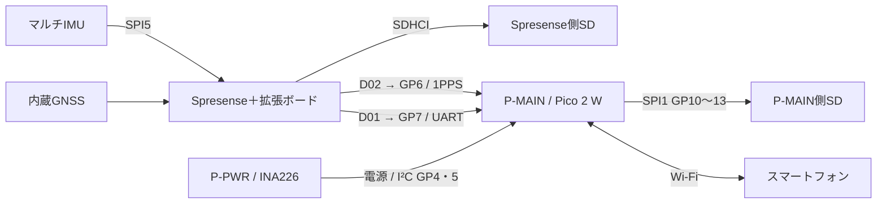
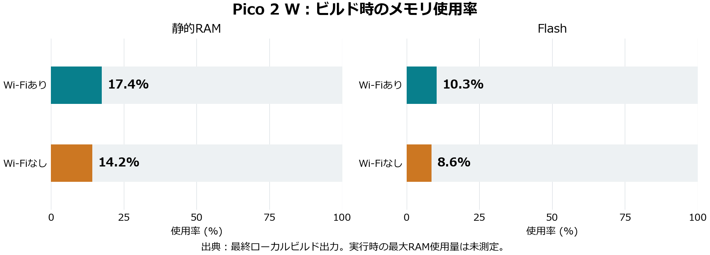

# 初期ファームウェアの動作確認

**結論：両ボードのビルド、通信・ログのPCテスト、模擬Web画面確認は合格。実機動作・SD保存・時刻精度は未検証です。**

| 項目 | 内容 |
|---|---|
| 実施日 | 2026-09-19〜20（日本時間） |
| 目的 | ビルド可能で、通信・ログ検証・Web画面の基本処理が動くことを確認 |
| 対象commit | `821317766d7bf26252876a9c14f72dfe5324145d` |
| 基板設計 | AquaBeacon P-MAIN v5.9 / P-PWR v1.5。実物版数は未確認 |
| 環境 | Windows、PlatformIO 6.2.0、Sony Arduinoコア3.4.7。GitHub Actionsでも確認 |

## 前提条件

### 接続機器

| 機器 | この検証での確認状況 |
|---|---|
| USB接続のPico | COM6、VID:PID=2E8A:F00Fを検出。親機か子機か未確認。書き込みなし |
| Spresense＋拡張ボード | USB接続を検出できず。想定はCXD5602PWBMAIN1＋CXD5602PWBEXT1 |
| SonyマルチIMU Add-on | 部品表に基づくCXD5602PWBIMU系を想定。実接続未確認 |
| P-PWR、INA226 | プログラムの対象。基板間接続・給電・測定値は未確認 |
| Pico側／Spresense側SD | ユーザー申告では両方に挿入済み。型番・容量・形式・読書き未確認 |
| TX基板、RTC等 | 接続有無未確認。GP16はLow固定で送信しない |
| RX、水温・水圧センサー、テザー、LCD | ユーザー申告で未接続。プログラムでも使用しない |

### ピン配置・給電（設計上の前提、実配線の導通確認は未実施）

| 機能 | 接続元 → 接続先 | 設定 |
|---|---|---|
| 1PPS | Spresense拡張D02 → J_SPR1.1 → Pico GP6（物理9） | 3.3V、立ち上がり入力 |
| GPS・状態UART | Spresense拡張D01 → J_SPR1.2 → GP7（物理10） | PIO受信専用、115200 bps、8N1 |
| GND | Spresense GND → J_SPR1.3 → Pico GND | 共通GND、J_SPR1から給電しない |
| 電源監視I²C | P-PWR J_I2C → P-MAIN J_I2CP → GP4/5（物理6/7） | SDA/SCL、100 kHz、INA226=0x40 |
| INA226 ALERT | P-PWR → GP3（物理5） | 入力、しきい値未設定 |
| Pico microSD | SPI1 → GP10/11/12/13（物理14/15/16/17） | SCK/MOSI/MISO/CS、1 MHz |
| SDカード検出 | GP15（物理20） | Low=挿入を想定。親機実物では未確認 |
| 状態LED | GP2（物理4） | 出力 |
| 起動時3.3V検出 | ボタンラダー → GP26（物理31） | ボタン未押下が前提 |
| TX | GP16（物理21） | Low固定 |
| 主基板給電 | P-PWR → J_PWR1 | 1/2=5V、3/4=GND、5/6=3.3V |
| Spresense IMU／SD | Sonyボード内SPI5／拡張SDHCI | Pico側SPIとは別 |

拡張ボードは **JP1=3.3V、JP10 pin1–2開放**。Spresenseは別給電、外付けGNSS用J_GNSS1は未接続とする。Pico USBだけでは周辺の3.3Vを供給できない。シャントは20 mΩ。参照元とハッシュは[配線資料](../../docs/HARDWARE.md)に記録。

図は**想定構成**であり、全機器の実接続を確認した図ではありません。GNDは共通です。

## 何をしたか

1. 基板設計・実配線メモでピンを確認。旧EVENT_MARKだったGP7を受信専用にした。
2. Pico無線あり・なしとSpresenseの3構成をビルド。SD保存失敗、一時ファイルが残った場合の処理を見直して再ビルドした。
3. 共通C++コードへCRC破損、途中欠落、ノイズ、PPS途絶・異常周期・重複、UTC飛び、カウンター境界を入力して判定を確認した。
4. ログ検証ツールに正常・破損・切断・欠落・保存エラー・未同期UTC・空ログを入力し、検出結果を確認した。
5. **架空データ**のローカルAPIでWeb表示、停止→取得可能、再開を確認。スマホ幅390×844でも表示を確認した。
6. 対象commitのGitHub ActionsでPico・Spresense・共通テストの全ジョブ成功を確認した。

## 結果

| 確認項目 | 結果 | 判定 |
|---|---|---|
| Pico / 無線あり | 静的RAM 91,268 / 524,288 B（17.4%）、Flash 432,100 / 4,190,208 B（10.3%） | ビルド合格 |
| Pico / 無線なし | 静的RAM 74,432 / 524,288 B（14.2%）、Flash 361,036 / 4,190,208 B（8.6%） | ビルド合格 |
| Spresense | ツール報告の使用サイズ243,024 / 786,432 B（30.9%） | ビルド合格 |
| 通信・時刻判定 | 正常受信、異常排除・再捕捉、境界条件を確認 | PCテスト合格 |
| ログ検証 | 4テスト全件合格（各テスト内に複数条件） | PCテスト合格 |
| Web画面 | 表示・停止・再開の切替、スマホ幅を確認 | 模擬環境で合格 |
| GitHub Actions | tests / pico / spresenseの3ジョブ成功 | 自動検証合格 |
| 実機IMU・GPS・SD・Wi-Fi | 実機への書き込みなし | 未検証 |
| PPSとUTC秒の対応・絶対精度 | 測定なし | 未検証 |

出典は最終ローカルビルド出力。**起動中のヒープや最大使用量を測った図ではありません。** Pico core1の別スタック8 KiBやWi-Fi実行時割当は別途考慮が必要です。Spresenseはツールがプログラムと動的メモリに同一数値を報告するため、この比較図に含めていません。

根拠：[ビルド出力抜粋](evidence/build_summary.txt)、[数値・参照先](evidence/summary.json)、[GitHub Actions](https://github.com/ry32767/P_MAIN_experiment/actions/runs/35450727902)。

## 未検証事項・次の確認

COM6がP-MAINかを確認し、Spresenseを接続して書き込む。次回は別フォルダの実機レポートで、両SDの読戻し・連続記録、IMU値、屋外GPS、PPSの秒対応・時刻誤差、無線取得中の欠落とヒープを評価する。

`sync=1` はソフトウェアのPPS対応条件成立であり、絶対精度の合格ではない。今回はµs精度やIMUの精密UTC化を確認していない。[実験手順](../../docs/EXPERIMENT.md)を参照。

## 付記：報告書整備時の公開確認（2026-09-20）

ユーザーの全ソース公開承認後、リポジトリを公開へ変更し、GitHub Pagesを配信した。[ページ](https://ry32767.github.io/P_MAIN_experiment/)のHTTP 200と画面タイトル、[デプロイ成功](https://github.com/ry32767/P_MAIN_experiment/actions/runs/35451024534)を確認。これは公開先の確認であり、機体との無線接続試験ではない。[確認記録](evidence/publication.json)。
