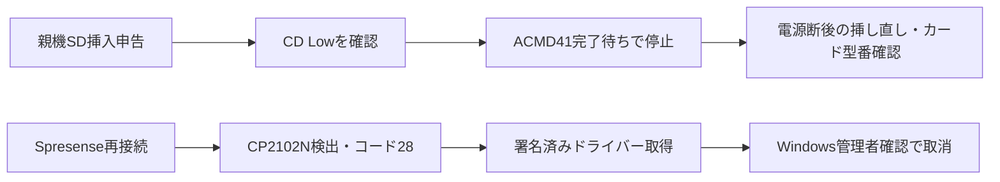

# SD初期化失敗とSpresense USBの切り分け

| 項目 | 内容 |
|---|---|
| 日時 | 2026-09-20 01:22〜01:30 JST |
| 目的 | 両SD挿入・Spresense再接続の申告を受け、前回の失敗原因を絞る |
| 対象 | 親機COM6、Spresense USB、親機INA226とSD |
| ソース | 開始HEAD `d67af7b` に、このレポートと同時コミットのUSB診断表示追加を適用 |
| 判定 | 電源監視通信・SD検出成功、SD初期化失敗、Spresenseドライバー導入未完了 |

## 前提条件

ユーザーが両基板へのSD挿入とSpresenseのUSB再接続を確認。親機COM6の識別は前回済み。SD型番・容量・形式、電源の供給方法、IMU型番、基板版数は未確認。RTC・磁気センサ・TX等の接続一覧も未確定。RX、水温、水圧、テザー、LCDは未接続との申告を継続適用。

| 機能 | 設計ピン・条件 | 今回の実確認 |
|---|---|---|
| SD SPI | GP10/11/12/13、物理14/15/16/17、SCK/MOSI/MISO/CS | 初期化コマンドが未完了 |
| SD挿入検出 | GP15、物理20、Low=挿入 | Lowを取得 |
| 電源監視I²C | GP4/5、物理6/7、INA226 0x40、20mΩ | メーカーIDと電圧・電流を取得 |
| ボタンラダー | GP26、物理31、12bit ADC | 4095（上限）、校正済み電圧値ではない |
| INA ALERT / LED | GP3/2、物理5/4 | ALERT=High、LED目視未確認 |
| Spresense UART/PPS | D01/D02 → GP7/6、物理10/9、3.3V、各100Ω | パケット・PPSなし、実配線未確認 |
| TX | GP16、物理21 | ファームでLow固定、送信なし |

Spresenseは拡張SDHCIとSony Multi-IMUを想定。詳細な接続前提は[配線資料](../../docs/HARDWARE.md)。INA226が測る入力電圧はSD端子の3.3V電源測定の代わりにならない。

## 何をしたか

1. PlatformIOとArduino CLIでポート列挙、WindowsでUSB機器とエラーコードを確認した。
2. Silicon Labs公式CP210xドライバーを取得し、カタログ署名がValidであることを確認した。通常の導入はアクセス拒否、正規の管理者確認を使った導入はWindowsから「ユーザーによって取り消されました」と返った。署名検証や管理者確認を迂回していない。
3. 親機の`h`出力にSDエラー番号・カード検出・ADC・INA226状態を追加。両Pico構成をビルドし、識別済みCOM6へ書き込んで照合した。取得処理やピン設定は変更していない。
4. 診断値を取得し、給電継続後にSD再初期化を1回行った。フォーマットは実施していない。

## 結果

| 項目 | 実測・確認値 | 解釈 |
|---|---|---|
| Spresense USB | CP2102N、VID:PID=10C4:EA60、問題コード28、DriverInfPathなし | USB検出済み、ドライバー未導入でCOMなし |
| 公式ドライバー | 11.6.0.420、署名Valid | 取得済み、導入未完了 |
| 親機診断ビルド | pico2w / pico2w_logger成功 | コンパイル確認 |
| 親機書込 | Verify OK、再起動、USB応答 | 成功 |
| SD検出 | sd_cd=0 | 挿入検出成功 |
| SD初期化 | code=0x17、data=0x01、再試行も同じ | ACMD41で初期化完了を待ってタイムアウト |
| SD記録 | rows=0、累積sd_errors=2 | 保存未開始 |
| INA226 | ina_ok=1、12.28875V / 0.075375A、再試行時12.28250V / 0.094500A | 通信成功。精度未校正、2回の取得値 |
| GPIO | buttons_adc=4095、alert=1 | ADC上限、ALERT High |
| ヒープ | 422,872 byte | 短時間観測、長時間安定性未評価 |
| GPS/PPS/IMU | packets=0、PPS=0 | 未検証、精度未評価 |

使用中のSdFat 2.3.1の`SdCardInfo.h`で0x17は`SD_CARD_ERROR_ACMD41`。`SdSpiCard.cpp`ではACMD41がReadyを返さないまま時間切れになる経路。data=0x01はIdle応答。ファイルシステム判定より前の失敗であり、フォーマットが原因と断定しない。カード・接触・SD側電源・通信条件を切り分ける。

公開可能な診断出力は[evidence/pico.txt](evidence/pico.txt)。生ログは`reports/raw/2026-09-20_004_sd_usb_diagnostics/`に保存し、パスワードは公開出力から除いた。

## 次に必要な確認

管理者確認画面が表示されたかをユーザーに確認し、ドライバー導入を完了してからSpresenseへ書き込む。親機SDはカード型番・容量を記録し、電源断後の挿し直しで再試験する。改善しなければSD側電圧・配線・別カードを比較する。双方のSD保存・IMU/GPSの動作と精度・統合時刻同期はまだ合格判定できない。

一次資料：[Sony USB接続とドライバーのFAQ](https://developer.spresense.sony-semicon.com/development-guides/?lang=en&page=faq)、[Silicon Labs公式CP210xドライバー](https://www.silabs.com/software-and-tools/usb-to-uart-bridge-vcp-drivers)。
