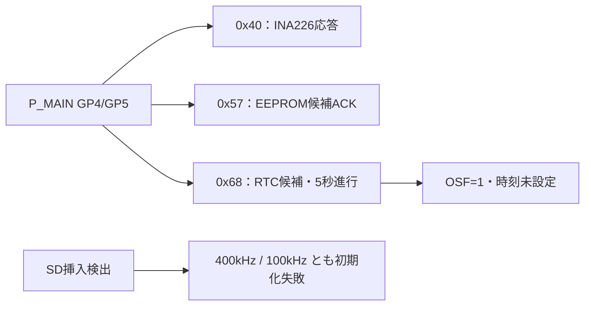

# 親機SDクロック比較・I²C機器・RTCの確認

| 項目 | 内容 |
|---|---|
| 日時 | 2026-09-20 01:50〜01:55 JST |
| 目的 | SD初期化失敗の通信条件を比較し、接続機器とRTC動作を調べる |
| 対象 | 識別済みP_MAIN COM6。開始HEAD `bb234ed`＋同時コミットの診断追加 |
| 判定 | SD改善なし、I²C応答・RTC時刻進行確認。正しい時刻・精度は未確認 |

## 前提条件

親機とSpresenseがUSB接続、両SD挿入済みとのユーザー申告。親機はINA226のメーカーIDと値を取得可能。給電方法、SD型番/容量/形式、基板版数は未確認。RX、水温、水圧、テザー、LCDは未接続との申告。Spresenseはブートローダー導入承認待ちでGPS/PPSの入力なし。

| 機能 | ピン・設定 | 実確認 |
|---|---|---|
| SD SPI | GP10/11/12/13、物理14/15/16/17、SCK/MOSI/MISO/CS | 初期化400kHzと100kHzを比較、通常転送上限は両者1MHz |
| SD CD | GP15、物理20 | Low |
| I²C | GP4/5、物理6/7、100kHz | 0x40/0x57/0x68が応答 |
| 電源監視 | INA226 0x40、20mΩ | メーカーIDと電圧・電流取得 |
| ボタン | GP26、物理31 | ADC=4095、各ボタン押下は未確認 |
| ALERT / LED | GP3/2、物理5/4 | ALERT=1、LED目視未確認 |
| PPS / UART | GP6/7、物理9/10、Spresense D02/D01 | 入力なし、同期未検証 |
| TX | GP16、物理21 | Low固定、送信なし |

RTCは設計上DS3231、0x57は付属EEPROM候補。アドレスのACKのみで機種確定とはしない。磁気センサ想定0x1C/0x1Eは応答なしだが、未接続・給電・故障等の区別は未確定。詳細は[配線資料](../../docs/HARDWARE.md)。

## 何をしたか

1. 標準設定のSDエラーを再取得した。
2. `pico2w_sd100`環境を追加し、SdFatの公式設定マクロで初期化クロックだけを100kHzへ変更。ビルド、書き込み照合、実機状態取得を行った。
3. 通常の`pico2w`へ戻した。記録停止中に限る`i`コマンドを追加し、I²Cアドレス0x08〜0x77にデータなしのACK確認を行った。
4. 0x68のレジスター0x00〜0x12を、約5秒間隔で2回読み取った。レジスターポインター指定以外の設定変更・時刻設定・EEPROMデータ書き込みは行っていない。
5. 診断追加後のWi-Fiあり/なし両構成のビルド成功、通常構成の再書き込み照合成功を確認した。最終的に親機は通常の400kHz初期化構成。

## 結果

| 条件 | SD CD | エラーcode/data | 保存行数 | INA226取得値 |
|---|---|---|---|---|
| 初期化400kHz（基準） | 0 | 0x17 / 0x01 | 0 | 12.24125V / 0.079250A |
| 初期化100kHz | 0 | 0x17 / 0x01 | 0 | 12.24000V / 0.075500A |
| 初期化400kHzへ復帰 | 0 | 0x17 / 0x01 | 0 | 12.23625V / 0.080125A |

SDは全条件でACMD41の初期化完了待ちがタイムアウト。低速化だけでは改善しなかった。電圧・電流はそれぞれ単発のIC取得値で、校正済み精度評価や同一負荷の比較ではない。

| I²C/RTC項目 | 実測結果 | 解釈 |
|---|---|---|
| ACKアドレス | 0x40、0x57、0x68 | 設計上の電源監視・EEPROM・RTCに整合 |
| RTC読出し1 | 2000-01-01 02:46:05 | DS3231形式で解釈。現在の正しい時刻ではない |
| RTC読出し2 | 2000-01-01 02:46:10 | 約5秒後に5秒進行 |
| Status | 0x88 | OSF=1、時刻を信頼できる状態ではない |
| 内部温度 | 27.00℃ → 26.75℃ | DS3231形式の取得値、温度精度未評価 |

[DS3231データシート](https://www.analog.com/media/en/technical-documentation/data-sheets/DS3231.pdf)に従いBCD時刻、Status 0x0Fのbit7、温度レジスター0x11/0x12を解釈。OSFは発振停止の履歴を示し、初回電源投入時にもセットされる。現在の発振停止や電池故障と断定はしない。USB操作間隔での5秒進行は粗い動作確認であり、時計のppm精度検証ではない。

公開出力は[evidence/measurements.txt](evidence/measurements.txt)。生ログとビルド・書込ログはGit管理外の`reports/raw/2026-09-20_007_sd_clock/`。途中の旧ファームからの取得も保存されているが、上表の復帰後の値とI²C結果には書き込み完了後の`inventory_after_upload.bin`を使った。

## 残件

SD型番・容量、電源断後の挿し直し、SD端子電圧、別カードの比較が必要。RTCのGNSSによる設定・校正、バックアップ保持、ボタン・LEDの実操作、磁気センサの接続確認、EEPROMの機種/保存領域確認は未実施。GPS受信・時刻同期・IMU/GPS精度はSpresense起動後に検証する。
