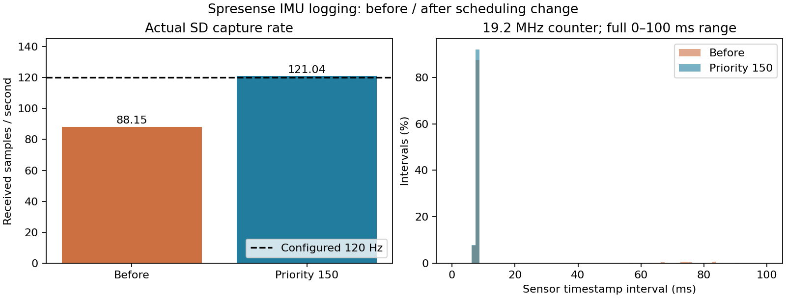

# Spresense IMU・GNSS・SDの初回取得と欠落改善

| 項目 | 内容 |
|---|---|
| 実施日時 | 2026-09-20 02:16〜02:29 JST |
| 目的 | 起動した実機で取得・保存を確認し、IMUの欠落原因を切り分ける |
| 対象 | Spresense COM7、親機COM6 |
| ソース | 開始HEAD `0c99a69`＋本レポートと同時コミットの診断・優先度修正 |
| 判定 | IMU・GNSSデータ取得とSpresense SD保存は一部合格。GPS測位・精度・統合同期は未達 |

## 前提条件

両SD挿入はユーザー申告。Spresenseは公式loader/GNSS等6パッケージ導入後。SD型番/容量/形式、IMUの実物型番、基板版数、静止状態、空の見通しは未確認。Sony Multi-IMUドライバーの初期化とデータ取得には成功した。SpresenseはUSB給電。親機のINA226は通信できるが、周辺電源の実測校正は未実施。

| 接続・機能 | ピン・設定 | 実確認 |
|---|---|---|
| Spresense USB | メインボードUSB、COM7、115200bps | 起動、コマンド、SDログ回収成功 |
| IMU | Multi-IMU、SPI5、120Hz、加速度レンジ4・角速度500 | 初期化・3軸加速度/角速度/温度の数値取得 |
| Spresense SD | 拡張SDHCI | 512B読戻し成功の起動経路を通過、CSV保存・停止・読出し |
| 内蔵GNSS | GPS、1秒周期、cold start | ナビゲーション更新を取得、測位未成立 |
| UART | 拡張D01→J_SPR1.2→GP7（物理10）、3.3V/100Ω | 実配線未確認、親機の受信パケット0 |
| PPS | 拡張D02→J_SPR1.1→GP6（物理9）、3.3V/100Ω | 実配線未確認、親機のPPS0 |
| GND | Spresense→J_SPR1.3 | 実配線未確認。JP1=3.3V、JP10 pin1–2開放を確認依頼 |
| 親機SD | GP10/11/12/13・物理14/15/16/17、CD=GP15・物理20 | 挿入検出あり、初期化エラー継続 |
| 親機電源監視 | GP4/5・物理6/7、INA226 0x40 | 12.19250V / 0.079500Aを単発取得 |

RX、水温、水圧、テザー、LCDは未接続との申告。親機TX GP16はLow固定。[全配線](../../docs/HARDWARE.md)。IMUを動かす・既知姿勢へ置く操作や外部計測器による比較は今回実施していない。

## 何をしたか

1. 起動ログでIMUカウンターとSpresense SD記録の増加を確認した。親機ではUART/PPS受信0、SDはACMD41初期化失敗だった。
2. 初期ファームでIMU受信が約88Hzだったため、記録を安全停止し、停止済みCSVをUSBへ取り出す`i`（IMU）/`g`（GNSS）を追加した。既存SDファイルは上書きしない。GPSのfix・使用衛星数・記録済み連番もUSB表示へ追加。
3. 最初の保存ファイルをCRC・連番・単調時刻で検証し、ハードウェアタイムスタンプを解析した。
4. 取得スレッドを明示的SCHED_FIFOにし、IMU優先度150、GNSS優先度120へ変更した。欠落判定も最小観測間隔を学習する方法から、Sonyの19.2MHzカウンターと120Hz設定に基づく方法へ修正した。以前の最小値方式は一度短い間隔が出ると、その後を誤って欠落扱いしていた。
5. 再ビルド・転送・ボード検証後、再度記録・安全停止・SD実ファイル回収を行った。比較は両方の生タイムスタンプから同じ閾値で行い、カウンター表示の変更だけで改善を主張していない。

## 実測結果

| IMU保存データ | 修正前 | 優先度修正後 |
|---|---:|---:|
| 行数 | 3,301 | 6,999 |
| 受信単調時刻による期間 | 37.437065秒 | 57.817935秒 |
| 平均受信レート | 88.14794Hz | 121.03511Hz |
| センサー時刻の最大間隔 | 91.86323ms | 8.59073ms |
| 12.5ms超の間隔数（名目周期の1.5倍） | 160 | 0 |
| 同一センサー時刻の連続数 | 0 | 0 |
| 行CRC/連番/単調受信時刻エラー | 0 | 0 |

図は両試験のSD実ファイルを使い、時間間隔はSony公式例に従い19.2MHzで換算した。縦軸は各試験内の割合。固定台・静止を確認していないため、加速度/角速度の散らばりをセンサー固有ノイズや精度とは呼ばない。修正後も中央値8.58771ms、最小5.72807msと間隔は完全一定ではなく、この図だけで時間軸の校正精度は保証しない。

| その他 | 結果 | 判定・限界 |
|---|---|---|
| Spresense SD | 全4ファイルのCRC・連番・単調時刻エラー0、USBログのSDエラー0 | 今回の短時間保存・回収は成功。長時間/電源断試験は未実施 |
| 修正後USBカウンター | imu_errors=0、gaps=0、queue_drops=0、gps_drops=0 | 観測期間内で問題なし |
| GNSS保存 | 修正前36行/35.109331秒、修正後56行/54.998993秒 | 約1Hzの更新・保存は成功 |
| GNSS測位 | 修正後ログ全行fix=1、使用衛星0、位置/時刻有効フラグなし | 測位未成立、位置/UTC精度未評価 |
| 親機受信・同期 | packets=0、PPS=0、sync=0 | 配線/JP設定の確認が必要。統合試験未合格 |
| 親機SD | MOUNT_FAILED、code=0x17/data=0x01、rows=0 | 未解決 |

取得スレッド優先度変更と欠落判定修正を同時に適用したため、変更を完全に分離した比較ではない。ただし保存データそのもののレート・長い間隔の改善は実測で確認した。使用した閾値は取得欠落の検出用で、要求精度の合否基準ではない。

公開根拠：[修正前](evidence/baseline.json)、[修正後](evidence/priority.json)、[GNSS構造検証](evidence/gps_validation.json)、[USB要約](evidence/status.txt)。生ログ・CSVは位置情報を含み得るためGit管理外`reports/raw/2026-09-20_009_initial_sensors/`に保存。解析は`scripts/analyze_imu_capture.py`、図はこのフォルダの`make_figures.py`で再生成できる。

## 未検証事項・次の実験

- **IMU精度：** 型番と静止条件を確認後、静止長時間・6姿勢・既知回転による比較が必要。今回の平均値だけで校正合格としない。
- **GPS精度：** 空が見える位置で測位を成立させる。ばらつきと、既知座標に対する絶対誤差を分ける。
- **統合時刻同期：** D01/D02/GNDとジャンパー、親機のUART/PPS受信を確認後、独立時刻基準との比較が必要。
- **親機SD：** カード型番/容量、電源断後の挿し直し、SD電源・配線、別カードの比較が必要。

回収のためSpresenseのSD記録は停止済み。IMU/GNSS取得とUART送信処理は継続する。`gps_seq`等の表示は最後に記録キューから取り出した値なので、停止後の現在の測位状態を示さない。次の記録には再起動が必要。

一次資料：[Sony公式IMUサンプル](https://github.com/sonydevworld/spresense/blob/master/examples/cxd5602pwbimu/cxd5602pwbimu_main.c)（19.2MHzタイムスタンプとレート設定）。
