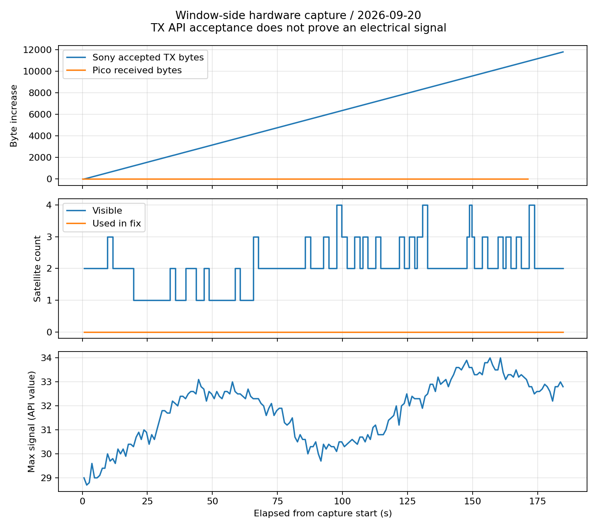

# 窓際でのGNSS受信と親子間UART・PPSの再検証

| 項目 | 内容 |
|---|---|
| 日時 | 2026-09-20 02:44〜02:51 JST |
| 目的 | 窓際への移動後の受信状態、UART/PPS、取得・保存の同時確認 |
| 対象 | 親機Pico 2 W COM6、Spresense COM7 |
| ソース | 開始HEAD `0bdaec3`＋本レポート同時コミットの診断追加 |
| 判定 | 衛星信号・IMU・Sony SD記録を確認。測位、親子通信、時刻同期は未達 |

## 前提条件

ユーザーが窓際へ移動し、時刻同期のピン接続を確認した。接触不良の可能性は残るとの申告。両SD挿入済み。カード型番・容量・形式、IMU実物型番、機体の静止状態、空の見通し、ジャンパー状態、信号電圧は未確認。両機USB接続、親機P-PWR電源監視は動作するが電源電圧の校正・SD端子3.3V実測は未実施。

| 機器・信号 | 設計上の接続・設定 | 今回の確認 |
|---|---|---|
| Sony IMU | SPI5 Multi-IMU、120Hz、加速度4・角速度500の設定 | サンプル増加・エラーカウンター確認 |
| Sony GNSS | 内蔵GPS、cold start、1秒更新 | 衛星情報取得 |
| Sony SD | 拡張基板SDHCI | 記録行数増加・安全停止 |
| UART | 拡張D01→100Ω→J_SPR1.2→GP7（物理10）、115200bps | ユーザー配線確認、導通・波形未測定 |
| PPS | 拡張D02→100Ω→J_SPR1.1→GP6（物理9） | 同上 |
| 共通GND・レベル | J_SPR1.3、JP1=3.3V、JP10 1–2開放が必要 | 電気的測定・ジャンパー実確認待ち |
| 親機SD | GP10/11/12/13（物理14/15/16/17）、CD GP15（物理20） | 挿入検出あり、初期化失敗 |
| 電源監視 | GP4/5（物理6/7）I²C、INA226 0x40、ALERT GP3 | 電圧・電流応答あり |
| RTC・EEPROM候補 | 同I²C上0x68/0x57 | 今回再検証なし、前回のACKのみで型番確定しない |
| ボタン・LED | GP26（物理31）/GP2（物理4） | ボタン未押下相当、押下・発光目視は未検証 |

RX基板、水温、水圧、テザー、LCDは未接続。GP16（物理21）はLow固定。外部GNSS共有入力は使用しない。[全ピン配置](../../docs/HARDWARE.md)。計測はUSB状態ログで、オシロスコープや外部時刻基準による測定ではない。

## 何をしたか

1. embedded-firmware・circuit-designスキルを適用し、既存ピン配置を維持して診断を追加した。親機にUART受信バイト数、入力レベル、CRCエラーを追加。Sonyに可視衛星数、最大信号値、UART書込受付バイト数を追加した。
2. 記録停止後もSonyのGPS状態表示が更新されるよう修正した。前回の停止後表示は古い値だったため、今回の窓際評価には新しい表示のみを使用した。
3. Pico両構成・Sonyをビルドし、識別済みCOM6/COM7へ書込・検証した。Sony転送は128B方式、ボードのPackage validation成功を確認した。
4. 約180秒間同時観測し、その後Sonyへ安全停止を送った。親機のh診断は約10秒ごと。起動・書込中の受信値を正常な通信とは見なさない。
5. Pythonログ検証4テスト、C++共通通信・時刻処理テストが合格。これらはPC上のテストであり、実機同期の合格ではない。

## 結果

| 観測項目 | 実測結果 |
|---|---|
| 可視衛星数 / 測位使用数 | 1〜4個 / 常に0個 |
| Sony UART受付 | 1,024→12,800バイト、受付エラー0（停止後5秒を含む） |
| Pico UART受信 | 14→14バイト、増加なし、有効パケット0 |
| Pico PPS / 同期 | 0回 / 未成立 |
| Sony SD保存行数 | 2,150→23,989行、安全停止応答あり |
| IMU / SDエラーカウンター | 0、IMU欠落・キュー溢れも0 |

具体的な開始・終了値とカウンターは[要約](evidence/summary.json)、時系列は[公開可能な状態ログ](evidence/status.json)に保存した。位置座標・Wi-Fi認証情報は含めていない。

- SonyのUART書込受付数は増加したが、親機の受信バイト数は観測開始時の14から増加せず、有効パケット0。14バイトは起動・転送時を含むため出所を断定できない。CRCエラー0でも、正しいフレームが届いている証拠にはならない。
- 親機PPS0、同期0。書込前の累計7エッジ・最終間隔5.2秒は安定PPSと認められず、再起動後に再現しなかった。
- GPS信号は見えたが、測位使用衛星0、時刻・位置有効フラグなし。最大信号はSony API値として図示し、外部校正済みの測定値とは扱わない。窓際移動前とは診断・再起動条件が異なるため改善量は算出しない。
- IMUとSony SDの行数は増加。今回の状態カウンターではエラー・欠落・キュー溢れ0。今回のSD全ファイル読戻し・全行CRC検証は未実施（前回009では実施済み）。
- 親機SDは引き続きACMD41エラー `0x17 / 0x01`、保存0行。信号不達との共通原因は未確定。

## 未検証事項・次の確認

UARTのAPI受付成功は端子の電気的出力を保証しない。ジャンパー、3.3V設定、共通GND、D01→GP7の導通・両端波形を順に確認する。接触不良は候補であり、今回のログだけでは断定しない。PPSもGNSS受信状態と両端波形を併せて確認する。配線の抜き差し・導通測定は記録停止を確認した後に電源を切って行う。

測位精度には既知地点、IMU精度には既知姿勢・静止条件、同期精度には外部PPS基準と計測器が必要で、今回はいずれも精度合格を出せない。親機SDはカード情報と電源・配線の確認が残る。

公式照合：[Sony端子・JP10説明](https://developer.sony.com/spresense/development-guides/introduction_en.html)、[Sony SDK UART2_TXD=D01](https://developer.sony.com/spresense/development-guides/sdk_developer_guide_ja)。ローカル公式Arduinoコア3.4.7でもSerial2(2)とUART書込処理を確認した。
