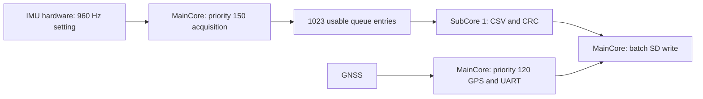
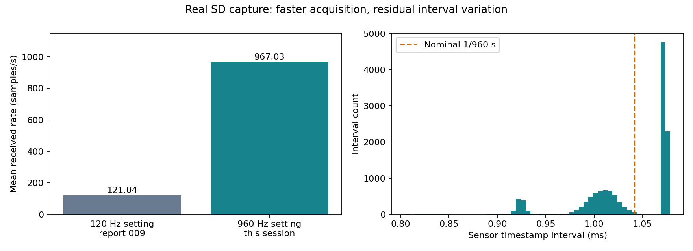

# IMU 960Hz・サブコア並列化と保存周期の実測

| 項目 | 内容 |
|---|---|
| 実施日時 | 2026-09-20 03:01〜03:12 JST（取得は約14秒、停止後にSD読出し） |
| 目的 | 高速化・処理分担を実装し、欠落と一定周期性を生タイムスタンプで評価 |
| 対象 | Spresense COM7、Multi-IMU、挿入済みSD |
| ソース | 開始HEAD `e7116e8`＋本レポート同時コミットのMainCore/SubCore変更 |
| 判定 | 960Hz設定・サブコア稼働・SD全行検証は成功。厳密な等間隔取得は未達、長期安定性は未検証 |

## 前提条件・ピン配置

ユーザー申告：P_MAINのSony向けXH右端へGNDを接続、信号ピンの逆接続の可能性あり。AquaBeaconの実機配線資料は「部品面を上から見て左からD02/PPS、D01/UART、GND」。**同じ見方なら右端GNDは一致する**。実機導通・信号波形は未測定で、左右の申告だけでは他の2本の正しさは確定できない。資料の古い4P/NC記述より実機3Pの記述を優先した。

既存ハーネスをcircuit-designスキルのnetlist.pyでモデル化し、構造チェックを通した。[生成ピン表・ネット表](evidence/pinmap.md)。電源レールを省略した信号のみのモデルであり、実接続や電気特性の合格を意味しない。

| 接続機器・機能 | ピン・条件 | 状態 |
|---|---|---|
| Spresense USB | メインボードUSB COM7、115200bps | 電源・書込・停止・ログ回収 |
| Sony Multi-IMU | SPI5、加速度レンジ4・角速度500、FIFO閾値1 | ドライバー取得成功。実物型番・機体の静止状態は未確認 |
| Sony SD | 拡張SDHCI | 挿入申告あり、型番・容量未確認 |
| 内蔵GNSS | GPS、1Hz | 同時稼働。屋外測位・精度検証はユーザー指定で後日 |
| PPS | 拡張D02→J_SPR1.1→100Ω→GP6（物理9） | 配線変更なし、今回電気測定なし |
| UART | 拡張D01→J_SPR1.2→100Ω→GP7（物理10） | 受信専用、配線変更なし |
| GND / レベル | J_SPR1.3、JP1=3.3V、JP10 1–2開放が必要 | GND位置申告あり、ジャンパー・電圧未確認 |
| 親機SD | GP10/11/12/13、CD=GP15 | 挿入済み。前回のマウント失敗から再検証なし |
| 親機INA226・RTC/EEPROM候補 | GP4/5 I²C、0x40/0x68/0x57 | 前回結果を引継ぎ、今回未試験 |
| 親機LED / ボタン | GP2 / GP26 | 今回未試験 |

RX、水温、水圧、テザー、LCDは未接続。GP16はLow固定。[全ピン表](../../docs/HARDWARE.md)。両機USB接続、SonyはUSB給電。基板版数・校正済み外部時計・既知姿勢・回転基準は未確認。開発環境はArduino CLI＋Sonyコア3.4.7、PicoはPlatformIOの既存固定版。

## 何をしたか

1. embedded-firmware・circuit-designスキルを使用。公式対応ODRを確認し、120Hzから960Hzへ変更した。先にSubCore 1、続いてMainCoreを書き込み、両パッケージのボード側検証に成功した。
2. MainCore内のIMU取得を優先度150、GNSSを120の別タスクに維持。CSVの浮動小数点整形とCRC32計算を**実際のSubCore 1**へ移した。単なる同一コアのスレッド増加ではない。
3. MP共有バッファは9,240B、1ジョブ最大32行。メッセージで所有権を移し、返却まで再利用しない。MainCoreは完成したCSVをまとめてSDへ書く。センサー周期はIMU自身が生成し、ソフトの待ち時間でサンプルを作らない。
4. サブコア不在・不正応答・2秒応答停止では記録失敗として停止する処理を追加。これらの異常系はコード・ホスト境界テストで確認し、実機で故障注入はしていない。
5. GNSS・SDを併用して取得、安全停止後に実ファイル`I00004.CSV`をUSBへ全量回収。全行CRC、連番、受信時刻、センサー時刻の差分を検証した。約1.47MBの生ログは非公開フォルダに保存。
6. 検証ツールの従来120Hz固定の警告・欠落閾値を周波数指定対応へ変更。`analyze_imu_capture.py --rate 960`、`verify_logs.py --imu-rate 960`で再現できる。

## 実測結果

| 項目 | 前回009・120Hz設定 | 今回960Hz設定 |
|---|---:|---:|
| 検証したIMU行数 | 6,999 | 13,389 |
| 受信時刻の期間 | 57.817935秒 | 13.844486秒 |
| 平均受信レート | 121.0351Hz | **967.0276Hz** |
| センサー時刻換算の平均レート | 比較JSON参照 | 965.9167Hz |
| センサー間隔の最小〜最大 | 5.7281〜8.5907ms | **0.8045〜1.0788ms** |
| センサー間隔の標準偏差 | 0.4134ms | **0.0481ms** |
| 設定周期の1.5倍超 / 同一時刻 | 0 / 0 | 0 / 0 |
| CRC・連番エラー | 0 | 0 |
| 今回状態ログのキュー溢れ・IMU/SDエラー | — | 0 |
| サブコア完了バッチ / エラー | 未使用 | 665 / 0 |

今回の受信間隔は0.030〜2.106ms、中央値1.038ms。これはアプリが読み取った時刻であり、センサーの取得瞬間やUTC精度ではない。センサー時刻はSony公式例と同じ19.2MHz換算で、カウンター周波数の外部校正はしていない。

取得レートは前回の約7.99倍。ただし、**ODR変更・並列化・バッチ書込を同時に行ったため、倍率をサブコア単独の効果とは言えない**。保存行数13,404はIMU13,389＋GNSS13＋ヘッダー2行。`STOPPED_REMOVE_SD`を受信してから回収した。

公称960Hzの周期は1.041667msだが、実測のセンサー間隔は複数の値に分布する。標準偏差は平均間隔の約4.64%。**「厳密に一定周期」は合格としていない。** 後処理で等間隔に並べ直して生取得が改善したようには扱わない。

根拠：[960Hz全行検証・統計](evidence/imu_960.json)、[前回120Hzの再解析](evidence/imu_120_reference.json)、[状態ログ](evidence/status.txt)、[ヒストグラム集計](evidence/interval_histogram.json)。SHA256は検証JSONに記録。

## ソフトウェア検証

- MainCore 249,732B、SubCore実使用タイル128KB（コンパイラ表示74,860B）。共有バッファ9,240B。MainCore選択は768KBを維持。
- MainCore/SubCoreビルド、Pico両構成ビルド成功。
- C++共通テスト、バッチ境界・全行CRC・最大値時の整形失敗テスト、Python5テスト成功。
- GitHub ActionsとPowerShellビルド補助もSubCoreを含むよう更新。ビルド成功は実機長期安定性の代替ではない。

## 残る確認

13.84秒の保存試験なので、長時間運転・SD書込遅延の最悪条件は未検証。一定周期性をさらに詰めるにはIMU内部の出力周期・タイムスタンプ仕様と基準時計との比較が必要。現時点でばらつきの原因をCPU不足や接触不良と断定できない。許容ジッターの目標も未指定。1920Hzは公式対応値だが今回は実測しておらず、960Hzを現行設定とする。

IMUの加速度・角速度の精度、軸方向、温度ドリフト、GPS屋外精度、親機UART/PPS同期精度は別の検証として残す。記録停止済みで、再記録は再起動。配線の抜き差し・導通測定は電源を切って実施する。

一次資料：[Sony公式IMU取得例・対応ODR](https://github.com/sonydevworld/spresense/blob/master/examples/cxd5602pwbimu/cxd5602pwbimu_main.c)、[Sony MP開発ガイド](https://developer.spresense.sony-semicon.com/development-guides/?lang=en&page=arduino_developer_guide)。MP共有メモリの使い方はインストール済み公式3.4.7のSharedMemory例も照合。
