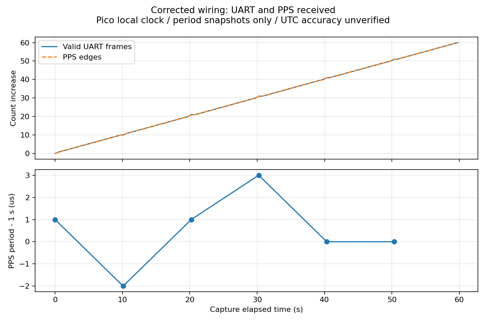

# 配線修正後のUART・PPS到達確認

| 項目 | 内容 |
|---|---|
| 実施日時 | 2026-09-20 03:25〜03:28 JST |
| 目的 | ユーザーによる同期配線修正後、親機への通信とPPS到達を確認 |
| 対象ソース | `ef7a6f2`。Sonyは011の960Hz・SubCore版、Picoは010の診断版を継続。今回書込・コード変更なし |
| 判定 | UART有効フレーム・PPS受信成功。UTC同期・絶対精度は未成立/未検証 |

## 前提条件

ユーザーから誤接続を修正したとの申告。どの線を入れ替えたかは未確認。部品面を上から見たXH 3Pの並びは左からPPS・UART・GND。想定ピン表は以下のとおりで、物理的導通測定は実施していない。

| 接続機器・信号 | ピン・設定 | 実確認 |
|---|---|---|
| Sony UART→親機 | 拡張D01→J_SPR1.2→100Ω→GP7（物理10）、115200bps | CRC付きデータ受信成功 |
| Sony PPS→親機 | 拡張D02→J_SPR1.1→100Ω→GP6（物理9） | 立上りカウンター増加 |
| 共通GND・電圧 | J_SPR1.3、JP1=3.3V、JP10 1–2開放が設計条件 | 接続修正申告、電圧・ジャンパー状態の直接確認なし |
| Sony USB / 内蔵GNSS | COM7 / GPS 1Hz | 状態取得・送信継続、未測位 |
| Sony IMU / SD | SPI5・960Hz設定 / SDHCI | IMU取得継続、SDは011終了時から停止中 |
| 親機USB / SD | COM6 / GP10/11/12/13、CD GP15 | SD挿入検出あり、マウントエラー継続 |
| 親機電源監視 | I²C GP4/5、INA226 0x40 | 状態応答あり |
| RTC・EEPROM候補、LED、ボタン | 同I²C 0x68/0x57、GP2、GP26 | 今回個別試験なし |

両機USB接続、両SD挿入申告済み。SD型番・容量、基板版数、信号電圧、電源の校正は未確認。RX基板、水温、水圧、テザー、LCDは未接続。GP16はLow固定。[全ピン配置](../../docs/HARDWARE.md)、[011の構造チェック済み信号接続表](../2026-09-20_011_imu_multicore/evidence/pinmap.md)。GPS屋外測位はユーザー指定で後日に保留。外部基準時計・オシロスコープは使っていない。

## 何をしたか

1. USBから両機の既存診断を約60秒間同時取得。親機の詳細診断は約10秒ごとに6回取得した。
2. 有効フレーム・PPSのカウンター差分とCRCエラー、GPS有効フラグを確認した。起動時からの累計値を今回の受信数と混同しない。
3. Sonyは開始時からSD停止中で、終了時にも`sd=0 / sd_errors=0`を確認。GPS/IMU取得とUART送信は停止後も継続する。
4. 生ログは非公開のreports/rawへ保存。公開証拠は許可した状態行だけを抽出し、Wi-Fi認証情報・位置座標を除外した。

## 結果

| 項目 | 結果 | 判定 |
|---|---|---|
| 観測区間 | 親機ログの開始〜終了59.780秒 | 状態観測 |
| 有効フレーム | 1,223→1,283、**60件増加** | 通信成功 |
| PPS立上り | 1,254→1,314、**60回増加** | 信号到達成功 |
| CRCエラー / 受信溢れ | 0 / 0 | 観測範囲内で発生なし |
| PPS周期・6点のスナップショット | **999,998〜1,000,003µs** | Pico内部時計で約1秒、全周期統計ではない |
| PPSからデータ到着まで・同6点 | **10,019〜10,347µs** | 現行の20ms下限に抵触 |
| 親機でのIMUカウンター | 終了時1,150,990 | Sony状態データの受信を確認 |
| GPS | 可視2〜4個、測位使用0個、flags=8（IMUのみ有効） | GPS時刻・位置は無効 |
| UTC同期 | 全状態ログでsync=0 | 未成立 |
| 親機SD | code=0x17、data=0x01、保存0行 | マウント失敗継続 |

前回010ではUART受信数が増えずPPS0だった。今回は両方が増加しており、配線修正後に信号が到達することを確認できた。ただし、どの線の誤接続だったか、接触不良が完全に解消したかはログからは断定できない。

**PPS周期が1秒に近いことはUTC同期精度が数µsであるという意味ではない。** Pico内部時計・割込み時刻による測定であり、GNSS有効時刻と外部基準の比較は未実施。

## 同期に残る条件

現在の`aq::Clock::accept`は、GPS時刻有効、PPS後20〜800msでのデータ受信、秒・連番の連続性などを条件にする。今回はGPS時刻フラグが無効で、さらに受信遅延が約10msのため20ms下限にも抵触している。したがって、**屋外で測位するだけで現行コードが必ず同期成立するとは言えない**。

屋外で有効なGPS時刻が取得できた際に、フレームのUTC秒がどのPPSに対応するかを実測し、受付窓を見直す。今回、無効時刻のまま閾値を緩めたり同期を強制したりはしていない。UARTレイテンシとUTC絶対誤差を区別し、1秒ずれがないことも確認する必要がある。

記録は停止状態を維持。配線抜き差し・導通測定は電源を切って行う。今回ファーム変更なしのため再ビルド・ホストテストは行わず、実機ログを根拠とした。

証拠：[集計値](evidence/summary.json)、[状態ログ](evidence/status.json)。
