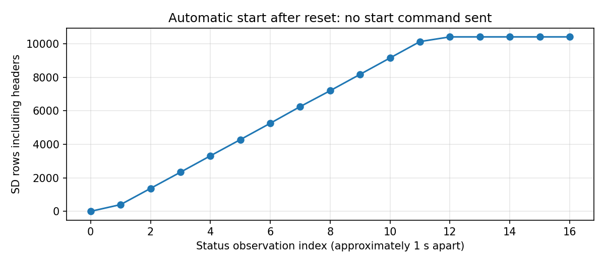

# Spresense SD保存形式・自動起動の確認

| 項目 | 内容 |
|---|---|
| 日時 | 2026-09-20 14:25〜14:30 JST |
| 目的 | 保存形式と、開始コマンドなしでSD記録を開始するかの確認 |
| 対象 | COM7のSpresense、960Hz・SubCore 1構成 |
| ソース | HEAD `a0e6895`。作業ツリーには別作業の未コミットLED変更があるが、今回書込・変更していない。実機バイナリのハッシュ照合は未実施 |
| 判定 | リセット後の自動開始・短時間保存は成功。電源完全断からの単独起動は未実施。開始前に既存エラーを確認 |

## 前提条件・接続

両SD挿入済みとの過去申告。今回Sony SDマウント・512B読戻しを実機確認した。カード型番・容量・FAT形式は未確認。COM7を既知のSonyとして使用し、親機や他のCOMポートには操作していない。

| 機器・信号 | ピン・設定 | 確認範囲 |
|---|---|---|
| Spresense USB | メインボードUSB、COM7、115200bps | 通電中のDTRリセットと読出し |
| Sony IMU | SPI5 Multi-IMU、960Hz設定、FIFO閾値1 | 自動取得・保存 |
| Sony SD | 拡張ボードSDHCI | 書込・停止・ファイル読戻し |
| 内蔵GNSS | GPS 1Hz | 未測位でも状態行を保存 |
| UART | 拡張D01→J_SPR1.2→100Ω→Pico GP7（物理10） | 前回修正済み、今回は経路未検証 |
| PPS | 拡張D02→J_SPR1.1→100Ω→GP6（物理9） | 同上 |
| 共通GND | J_SPR1.3、JP1=3.3V・JP10 1–2開放が設計条件 | 今回電圧・ジャンパー未測定 |
| 親機・P-PWR・親機SD | 既存構成、SD SPI1 GP10/11/12/13、CD GP15 | 今回操作・検証なし |

RX、水温、水圧、テザー、LCDはこの実験の対象外（従来申告では未接続）。別作業での構成変更はこの試験では追跡していない。[全配線](../../docs/HARDWARE.md)。USBを介した通電を維持した試験で、電源立上り・電圧降下の測定は行っていない。

## 保存形式

SDのルートに、起動ごとのペアを作る。Spresense内部のパス表示は`/mnt/sd0/`。

| ファイル | 内容 |
|---|---|
| `I00000.CSV`など | IMU、設定960Hz。連番、受信単調時刻µs、32bitセンサー生時刻、温度、角速度xyz、加速度xyz、CRC32 |
| `G00000.CSV`など | GPS、約1Hz。連番、受信単調時刻µs、UTC秒・端数µs、有効フラグ、fix、使用衛星数、緯度/経度×10⁷、高度mm、IMU/SD状態カウンター、CRC32 |

カンマ区切り、先頭に列名、数値はASCIIテキスト。CRC32は最後のカンマより前の行内容から計算した8桁16進数。改行やCRC自身は計算対象外。GPS未測位時の座標0や時刻数値を有効測位として使わず、flagsの時刻有効bit0・位置有効bit1を確認する。

IMUの`received_mono_us`は起動後の読取り時刻で、UTCではない。センサー生時刻はSony例の19.2MHz換算で解析するが、実クロックの校正ではない。軸・単位・精度の実機校正は別試験。

既存I/G/V番号を避け、空き番号を検索して`O_EXCL`で新規作成する実装。通電中にCSVを自動分割・日付名へ変更する処理はない。初期確認の`Vxxxxx.BIN`は512Bの一時テストファイルで、検証後に削除する。今回のファイル名は`I00000.CSV`と`G00000.CSV`だった。以前のカード内容との同一性や媒体交換履歴は未確認で、過去ファイル保存状況は断定しない。

## 何をしたか

1. 現行ソースを読み、初期状態`recording=true`、setupからSD初期化・サブコア起動・IMU/GNSSタスク開始へ進み、USB接続待ちや開始コマンド待ちがないことを確認した。
2. 既存実機状態を保存。`sd_errors=2 / formatter_errors=1 / queue_drops=546 / imu_errors=1 / gaps=2`、記録停止状態だった。発生時刻や原因は不明。リセットでカウンターを消す前に証拠を残した。
3. COM7のDTRを操作してリセット。起動から約15秒間は送信コマンドなしで受信のみ行った。SD_READBACK_OK、サブコアready=1と保存行数の増加を確認した。
4. `q`で安全停止し、STOPPED_REMOVE_SDを確認。`g`と`i`で今回のGPS・IMUファイルを全量回収し、CRC・連番・時刻を検証した。

## 結果

- 開始指示なしでファイル作成・記録開始。SD総行数は2→10,408（ヘッダー含む）に増加した。
- IMU 10,397行（約10.75秒、平均967.21Hz）、GPS 9行。両方とも全行CRC・連番エラー0。全量検証結果は[evidence/gps_validation.json](evidence/gps_validation.json)。IMUの全量検証結果は[evidence/imu_validation.json](evidence/imu_validation.json)。
- 今回のリセット後の観測期間ではIMU・SD・サブコアのエラーカウンターは0、安全停止応答あり。
- リセット前に残っていた障害は未解決。短時間の再起動成功を長時間稼働の保証にしない。

[開始前の状態](evidence/before.txt)、[リセット後の状態](evidence/boot.txt)。生CSVは位置情報を含み得るためreports/rawに保存し、公開対象外とした。

## 電源を入れただけで動くか

**コード上は電源投入で自動開始する構成で、実機ではリセット後の自動開始を確認した。** ただし、今回PCのUSBは接続したままであり、完全な電源断→再通電やPCを接続しない電源だけでの起動は確認していない。この実測には、USBを含む給電を一度切り、再通電する物理操作が必要。

約1秒ごとにfsyncする設計だが、電源断の安全性や必ず1秒以内の損失に収まることを保証するものではない。通常終了は`q`後のSTOPPED_REMOVE_SD確認が必要。現状は電源だけの運用で安全停止する専用ボタンを用意していない。停止後の再開は再起動。

ファーム変更なしのため今回はビルド試験を追加していない。未実施：実電源投入試験、USB未接続運転、長時間保存、既存エラーの原因切り分け、カードの実ファイルシステム形式確認。
