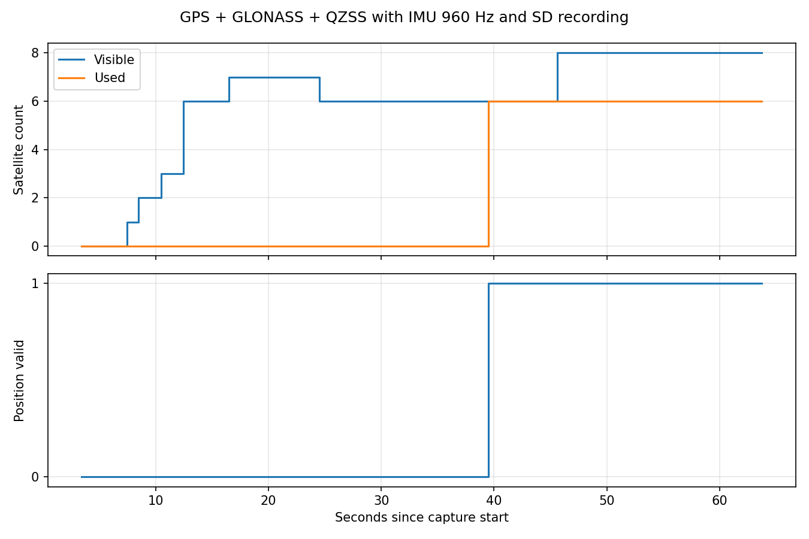

# GNSS衛星系と起動順序の改善・統合実機検証

| 項目 | 内容 |
|---|---|
| 日時 | 2026-09-21 10:42〜10:52 JST |
| 目的 | 成功した単体GNSS試験を参考に、IMU 960Hz・SDとの併用で測位を成立させる |
| ソース | 元統合実装はef7a6f2系。作業ツリーの既存LED変更を維持。本レポートと同時コミットのGNSS変更を実機に導入 |
| 判定 | GNSS先行起動で3D測位成功。IMU開始後も測位継続。位置・UTCの絶対精度や長期安定性は未検証 |

## 前提条件・接続

ユーザーよりSpresense GPS単体試験の受信成功を申告。隣接`spresense-gps-validation`のソース・READMEを読取り、GPS+GLONASS+QZSS L1C/Aで約51秒後にFixという記録を確認。今回の書込前にもCOM7の単体版からFix表示を3行取得した。単体版の緯度経度は公開しない。

| 機器・信号 | 設定・ピン | 実確認 |
|---|---|---|
| Spresense USB | COM7、115200bps | 単体版識別、MainCore書込・パッケージ検証成功 |
| 内蔵GNSS | GPS+GLONASS+QZSS L1C/A、1Hz、cold start | 設定応答・測位・SD保存 |
| Sony IMU | SPI5 Multi-IMU、960Hz、FIFO閾値1、レンジ4/500 | サンプル増加、各エラーカウンター確認 |
| SubCore 1 | 既存CSV整形・CRC処理 | ready=1、処理継続 |
| Sony SD | 拡張SDHCI | 読戻し確認・GPS実ファイル回収 |
| UART | 拡張D01→J_SPR1.2→100Ω→Pico GP7（物理10） | 送信処理継続、今回親機側は未操作 |
| PPS | 拡張D02→J_SPR1.1→100Ω→GP6（物理9） | 1PPS有効化処理を維持、今回波形未測定 |
| GND・電圧 | J_SPR1.3、JP1=3.3V、JP10 1–2開放が設計条件 | 前回修正申告を引継ぎ、今回電圧測定なし |
| LED0 | Spresenseメインボード | 既存受信表示コードを維持。目視試験なし |

SpresenseはUSB給電。カード型番・容量、基板版数、アンテナの向き・空の見通し、外部時刻基準は今回未測定。親機/P-PWR、親機SD・INA226・RTC等は今回の試験対象外。RX、水温、水圧、テザー、LCDについても今回検証なし。[全ピン配置](../../docs/HARDWARE.md)。別タスクの親子統合ファームへ書込はしていない。

## 原因候補と変更

単体版はGPS+GLONASS+QZSS L1C/Aだったが、以前の統合版はGPSのみを選択していた。公式ライブラリの対応設定を確認して衛星系を合わせた。ただし、それだけで約3分試しても測位しなかったため、IMUの開始順序も比較した。

採用した動作：

1. SDとSubCore 1を初期化し、GNSS受信・GPSログ記録を開始する。
2. IMUのSPI初期化と取得開始を初回Fixまで待つ。待つのはIMUタスクのみで、GNSSやGPSログを止めない。
3. 初回Fix後にIMUを開始する。FixできなくてもIMUタスク開始から最大120秒で待機を終了し、IMUを開始する。
4. IMU開始後にFixが失われてもIMUを止めない。再取得のたびに計測が中断する処理にはしていない。

IMUを記録し始めるまでに待ち時間が発生するため、**電源投入直後からIMUが必ず記録される仕様ではなくなる**。設定は`gnssAcquisitionWaitMs=120000`。GNSSは単体版と同じcold startを維持し、今回ephemerisの永続保存・hot start・5分ごとの再起動は導入していない。

`gnss_first_fix_ms`診断を追加した（0=未取得、非0は経過ms+1として保持。集計時に1を除く）。UARTフレームとSD CSVの列構成、ピン配置、IMU設定は維持。既存作業ツリーのLED0受信表示も同時ビルドに含まれる。

## 実機結果

| 項目 | 複数衛星系・同時開始 | 複数衛星系・GNSS先行開始 |
|---|---:|---:|
| GPS保存行数 | 175 | 54 |
| GPSログの期間 | 173.997秒 | 52.313秒 |
| 最大可視衛星 | 7 | 8 |
| 最大測位使用衛星 | 0 | **6** |
| 初回Fix | 観測中なし | **GNSS開始から約34.2秒、3D Fix** |
| 保存した位置有効行 | 0 | 21 |
| 保存した時刻有効行 | 0 | 20 |
| GPS全行CRC・連番エラー | 0 | 0 |
| IMU/SD/サブコアエラー | 状態ログで0 | 状態ログで0 |
| 終了操作 | 安全停止 | 安全停止 |

初回測位の直後にIMUが開始し、IMU+SD稼働中に時刻・位置有効の更新を20回連続で確認して停止した。停止後も受信・送信は続き、最後の診断でもFixを維持していた。IMUサンプルは23,722まで増加、保存総行数18,989、キュー溢れ・不連続カウンターとも0。今回IMU CSV全量の読戻しは行っていない。

この試験では開始順序変更後に測位成功し、IMU起動後も測位を継続した。一方、連続した別起動の比較であり、衛星配置や受信履歴を完全に揃えた試験ではない。RF干渉、電源ノイズ、処理負荷のどれが原因かは確定していない。測位後の信号値が下がる場面があっても、その値だけで電磁ノイズを断定しない。

証拠：[採用構成の集計](evidence/summary.json)、[状態ログ](evidence/status.json)、[GPS全行検証](evidence/gps_validation.json)、[同時開始の集計](evidence/simultaneous_summary.json)、[同時開始の状態](evidence/simultaneous_status.json)、[同時開始GPS検証](evidence/simultaneous_gps_validation.json)。生座標はreports/rawのみに保存。

## ビルド・確認と残件

Sonyコア3.4.7でMainCoreビルド成功（252,192B）、COM7への転送後Package validation成功。既存SubCoreのready=1を確認。C++共通テスト2本・Python5テスト成功。Picoと共通通信コードは変更していないため、今回Pico書込・ビルドは省略。

測位成功は位置誤差の合格ではない。親機側のUTC同期条件・約10ms到着に対する旧20ms下限・PPS秒対応は別検証として残る。GNSS有効時刻の保存と親機の時刻同期成立は区別する。長時間・移動中・電源再投入を繰り返した捕捉率、120秒フォールバックの実機到達試験は未実施。現在は安全停止済み、再起動するとこの先行起動構成で自動記録する。

一次資料：[Sony GNSSチュートリアル](https://developer.sony.com/ja/spresense/tutorials-sample-projects/spresense-tutorials/how-to-read-gps-information)、[Sony GNSS API](https://developer.spresense.sony-semicon.com/spresense-api-references-arduino/group__gnss)。公式3.4.7の`waitUpdate`は秒単位の待機で、既存1秒待機がミリ秒の高頻度ポーリングではないこともソースで確認した。
