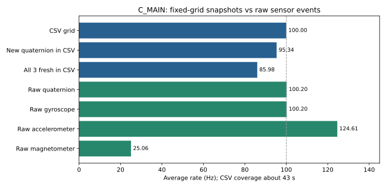

# 子機の再接続・IMU／SD／親機同期の確認

| 項目 | 内容 |
|---|---|
| 実施 | 2026-09-21 10:59–11:06 JST |
| 目的 | 接続済み子機の取得・保存・親機との相対同期を実機で確認 |
| 判定 | 一部合格。再保存は正常、旧ログ破損とセンサー時刻逆転は未解決 |
| 対象 | C_MAIN / Pico 2 W、設計C-MAIN v4.5。既存統合ファームウェア。書込み・コード変更なし |
| ソース | ローカルAquaBeacon_MAIN_firmwareを参照。既存実機のcommitは応答に含まれず未特定。参照ソースのSHA256をevidenceに記録 |

## 前提条件・接続一覧

子機COM3（USB serial A521D21EB1DCFB44）と親機COM6（A444A41EE9334705）を役割応答でも識別。両機USB接続、子機SD挿入済み。SDのメーカー・容量、外部給電経路の現物確認は未実施。子機ボタン系ADCは約3.25V、電源監視は約4.66V。V3Dは設計上J_PWR1の外部LDOから供給、Pico物理36番はNC。

BNO085、SD、RS485親子通信、INA226、TSYS01、MS5837は応答値あり。RTC応答はあるが2000年の日付で、UTCとして使用できない。子機の温度・圧力・磁気値は読み取り確認のみで、校正や絶対精度は未検証。RX/漏水/ボタンの実機刺激、音響測距、EEPROM、LCDは今回未検証。SpresenseのCOM7は今回検出されず、親機の古い衛星情報は通信期限切れのため測位成功と数えない。PCのWi-Fi設定変更なし。

ピンは`AquaBeacon_MAIN_firmware/include/pins.h`に基づく設定値。今回は導通・電圧の現物測定をしておらず、応答を確認できた範囲のみ実動作の根拠とする。

| 信号 | 子機GPIO（Pico物理ピン） | 条件・確認 |
|---|---|---|
| BNO085 SPI0 | MISO GP16(21), CS GP17(22), SCK GP18(24), MOSI GP19(25), INT GP20(26), RESET GP21(27) | 最大1MHz設定、姿勢・加速度・角速度・磁気の実データ取得 |
| SD SPI1 | SCK GP10(14), MOSI GP11(15), MISO GP12(16), CS GP13(17), CD GP15(20) | 実装4MHz、保存・読戻し |
| RS485 UART0 | TX GP0(1), RX GP1(2) | 115200bps、親子応答と相対同期 |
| I2C0 | SDA GP4(6), SCL GP5(7) | 100kHz、INA 0x40 / RTC 0x68 / 圧力0x76 / 温度0x77 |
| その他 | LED GP14(19), ボタンGP27(32), RX比較GP2(4), 閾値GP6(9), 包絡GP26(31), 漏水GP22(29) | 状態読取りのみ、物理刺激試験なし |

## 実施内容

1. 既存動作を観測後、`q`で保存完了を待ち、IMU・全BNOイベント・ヘルスの3ファイルをUSB回収。
2. 初回ログの破損を検出。旧ファイルを削除せず、`s`で新しい番号のログへ再マウント・記録開始。
3. 約45秒間の状態を取得し、安全停止後に3ファイルを回収。全行CRC、100Hz記録格子、センサー連番と時刻を検証。

実行環境はWindows/Python 3.13/pyserial。既存の`verify_imu_log.py`と`verify_raw_log.py`を使用。後者は時刻逆転を検出して不合格。追加集計でCRC・連番・時刻異常を分けて確認した。模擬試験・ビルド・書込みは実施していない。

## 結果

| 確認項目 | 実測 | 判定 |
|---|---|---|
| 初回SDログ | IMU CSVの16行目CRC不一致。イベント先頭1536バイト、ヘルス先頭236バイトがゼロ。ヘッダーも欠損 | 不合格。原因未特定 |
| 再保存IMU | 4,315行、43.14秒、100Hz格子欠落0、CRC不一致0 | この区間は合格 |
| 再保存イベント・ヘルス | 15,108行／42行、全CRC一致、ゼロ埋めなし | この区間は合格 |
| SD状態 | エラー累計0のまま。取りこぼし累計98→98で今回増分0 | エラー表示だけでは旧破損を検出できなかった |
| 記録タイミング | 遅れ中央値106µs、最大2,395µs | 10ms格子の時刻値。外部計測ではない |
| 毎行の値更新 | 姿勢が新しい4,114/4,315行、姿勢・加速度・角速度すべて新しい3,710/4,315行 | 毎行全値更新は未達 |
| 生イベント頻度 | 姿勢100.204Hz、角速度100.203Hz、加速度124.607Hz、磁気25.056Hz | 4種類とも連番欠落0 |
| センサー時刻 | 角速度に−2µs、姿勢に−76µsの逆転を各1回 | 時刻単調増加の検証は不合格 |
| 親子相対同期 | 状態88件すべてsync_ok、通信エラー0。内部不確かさ294–1,113µs、中央値432µs | 同期の動作成立。実誤差の校正は未実施 |
| UTC同期 | utc_valid=false、Spresense通信は期限切れ | 未成立・未検証 |

生イベントの平均約100.2Hzと、定周期ログに新しい姿勢値を残せた約95.3Hzは異なる。100Hzのログは最新値のスナップショットであり、イベント受信が同じ記録周期内に重なると中間値は生イベント側だけに残る。今回、生イベント連番の欠落はなかった。センサーの時刻逆転原因は未特定のため、厳密な時間解析にそのまま使用できるとは判定しない。

図は今回回収したCSVから算出。平均値であり、一定周期性・絶対精度を保証しない。[公開可能な集計根拠](evidence/results.json)。生データはローカルreports/raw/2026-09-21_013_child_reconnect/に保持。

再保存ファイルは`C_MAIN_IMU_100Hz_00013.csv`、`C_MAIN_BNO_EVENTS_00014.csv`、`C_MAIN_HEALTH_RANGE_00014.csv`。終了時は子機STOPPED、4,315行の保存完了を確認。親機の記録状態は変更していない。

## 残課題

- 初回破損は新規記録で再発しなかったが、接触・電源・媒体・ソフトの原因切分けは未完了。フォーマットや既存ログ削除はしていない。
- センサー時刻の小さな逆転と定周期への取り込みを改善する余地がある。異常を隠すための時刻補正はしていない。
- 電源投入直後から動いていた状態は観測したが、今回こちらで電源断・再投入を管理した起動試験は未実施。
- IMU絶対精度、温度・圧力校正、UTC同期、長時間保存は未検証。音響送信は行っていない。
