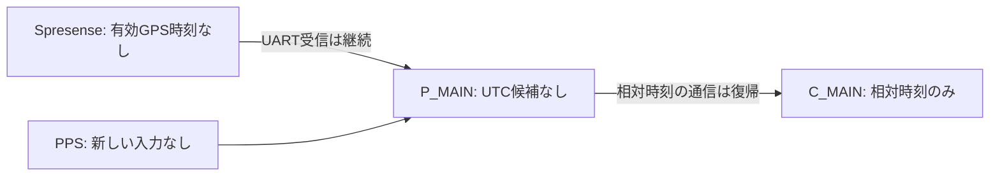

# GPS UTC同期の実機確認

| 項目 | 内容 |
|---|---|
| 日時 | 2026-09-21 JST |
| 目的 | Spresense → P_MAIN → C_MAINのUTC同期成立と精度を確認 |
| 結果 | UTC同期は未成立。実誤差は測定できず、精度判定は保留 |
| 対象 | 既存Pico 2 W親機・子機とSpresenseの送信データ。ファーム変更・書込みなし |
| 対象ソース | AquaBeacon_MAIN_firmwareの現行ローカルコードを確認。実機commitは応答に含まれず未特定。参照SHA256はevidence/results.json |

## 前提条件・接続一覧

親機COM6（USB serial A444A41EE9334705）、子機COM3（A521D21EB1DCFB44）をUSB識別と役割応答で確認。SpresenseのUSB COMは今回検出されず、親機が受信するUARTフレームの状態で確認した。SpresenseはUART応答上IMU・SD正常だが、今回は直接のSD読戻しをしていない。子機BNO085・SD・電源基板、親機SD・電源基板は前回検証の構成を継続。カード型番・容量、給電経路の現物測定は未確認。

開始時に親子RS485通信が期限切れだったため、ユーザーに配線・給電確認を依頼。「完了しました」の返答後、相対同期の復帰を確認した。親機温度・圧力・LCD、音響測距、センサー校正は対象外。PC Wi-Fiの変更なし。外部UTC基準器・オシロスコープによる測定なし。

| 信号 | 設計上の接続・ピン | 今回確認 |
|---|---|---|
| GPS UART | Spresense D01 TX → 100Ω → 親機GP7（Pico物理10）、115200bps、受信専用 | 新しいフレームを継続受信、CRCエラー増加なし |
| GPS PPS | Spresense D02 → 100Ω → 親機GP6（物理9） | 観測中に入力カウント増加なし。導通・波形測定は未実施 |
| 共通GND | Spresense・親機のGND | 今回の現物確認なし |
| RS485 | 両Pico UART0 TX GP0（物理1）/ RX GP1（物理2）、115200bps、自動方向モジュール経由 | ユーザー確認後に通信復帰 |
| SD | 両機SPI1 SCK GP10(14), MOSI GP11(15), MISO GP12(16), CS GP13(17), CD GP15(20) | 保存状態を読取りのみ。親機記録継続、子機STOPPEDを維持 |

GPIOの根拠はinclude/pins.hと既存の接続資料。Spresense拡張側3.3V設定を前提とし、今回は電圧を測定していない。

## 実施と実測結果

USBで両Picoの状態を12秒、続いて60秒観測。接続確認の返答後にさらに25秒観測した。コマンドは状態読取りのみで、記録開始・停止、リセット、音響送信は行っていない。

| 確認項目 | 結果 | 判定 |
|---|---|---|
| 親子通信 | 確認後に両側link_rxが増加し、相対同期sync_ok=trueへ復帰。CRC通信エラー0 | 相対同期の動作復帰 |
| GPS UART | 確認後の全観測でlink_fresh=true、フレーム数が増加 | 通信成立 |
| GPSの有効時刻 | time_valid=false、fix_valid=false、測位使用衛星0 | UTC源が無効 |
| PPS入力 | pps_count=9691から増加なし、pps_fresh=false | 新しいPPS未確認 |
| PPS周期表示 | 52,815µsが表示されるが古い最終値。今回の継続パルス周期を意味しない | 正常な1Hzと判定できない |
| 親機UTC候補 | sync_candidate=false、utc_candidate_us=null、時刻参照source=none | UTC同期未成立 |
| 子機UTC | utc_valid=false | 現行コードにUTC配信・換算処理なし |
| 絶対時刻誤差 | 有効UTC・PPSが揃わず、比較基準も未接続 | 測定未実施 |

## コード確認・ホスト模擬検証

現行のPPS/UTC処理は、1秒間隔、フレーム有効時刻、PPS後20–800msの受信時刻、3回連続の対応などで候補を判定する。ただし、これだけではUTCの秒番号とPPSの1秒ずれを検出できないため、実信号の照合が必要。

トップレベルのutc_validは現行コードでfalse固定であり、それだけではGPS受信の診断にならない。今回の未成立判定は、別のGPS有効時刻・PPS・UTC候補の状態にも基づく。親子プロトコルには相対offsetがあるが、UTCの基準時刻を子機に送る処理はない。そのため、GPS受信が戻るだけで子機までUTC同期が完成する構成ではない。

既存ホストテストを実行し、CRC・フレーム解析、相対同期、PPS候補の成立・期限切れ・重複・時刻ジャンプ・桁あふれ処理が合格。スマホ時刻・SD復旧の既存テストも合格。これは模擬入力によるロジック検証であり、GPS受信成功や絶対精度の証明ではない。[テスト結果](evidence/host-tests.txt)、[実機集計](evidence/results.json)。生ログはローカルreports/raw/2026-09-21_014_utc_validation/に保持。

## 次に必要な確認

1. Spresenseで測位・有効UTCを取得し、親機GP6に新しい1PPSが届くことを確認する。USBは現在PCに認識されていないため、直接診断にはUSBデータ接続の復帰も必要。
2. PPSと送信UTCの秒対応を実機で照合する。判定の時間幅を広げるだけで同期成功扱いにはしない。
3. 親機のUTCが確認できた後、子機へのUTC基準配信・期限切れ処理・ログへのUTC記録を実装して検証する。
4. 独立した基準または同一基準パルスの同時計測で誤差を測定する。ソフト内のuncertaintyは絶対精度の実測値ではない。

終了時、親子相対通信は復帰、親機SD記録継続、子機は安全停止状態のまま。UTC検証は未完了であり、合格とは判定しない。
