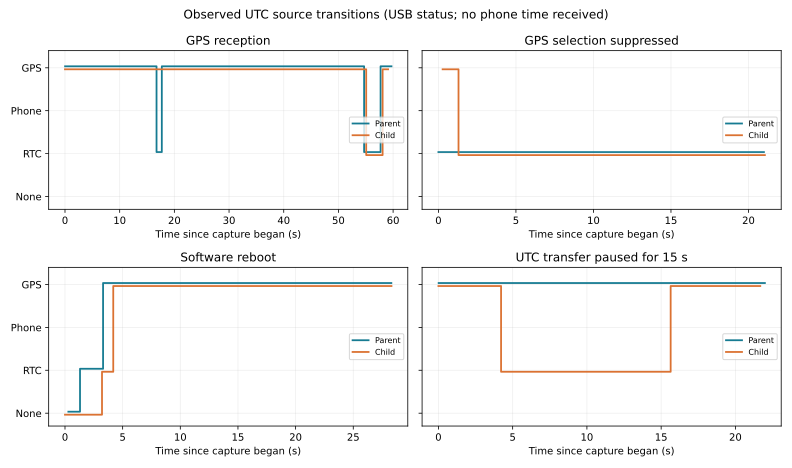

# 親子UTC同期・Wi-Fi時刻・RTC保存／復元

| 項目 | 内容 |
|---|---|
| 実施 | 2026-09-21 JST、窓を開けた状態で再実験 |
| 目的 | GPS UTCの親子同期、GPS不在時のWi-Fi端末時刻への切替、RTC保持を追加・検証 |
| 結果 | GPS→親機→子機、両RTC書込・読戻し、ソフト再起動復元、RTC代替動作を実機確認。Wi-Fi端末からの受信と物理電源断保持は未確認 |
| 対象 | P_MAIN/C_MAIN Pico 2 Wの親子統合コード。親子とも更新。Spresenseは既存GNSS改良版を継続、書込みなし |
| ソース | 本レポートと同じ公開コミットのfirmware/main_control。実機に書いた主要ソースSHA256をevidence/results.jsonに保存 |

## 前提・接続機器

親機COM6（USB serial A444A41EE9334705）、子機COM3（A521D21EB1DCFB44）を個体と役割応答の両方で照合。両機SD・電源基板、子機BNO085、親子RS485、SpresenseのUART/PPSを使用。子機温度・圧力・RTC・電源監視も既存構成を維持するが、校正は今回対象外。SpresenseのUSB COMは検出されず、親機経由の受信状態を観測。SDメーカー・容量、RTCバックアップ電池の有無と状態、外部給電経路の現物確認は未実施。

ユーザーが窓を開放。GPSの使用衛星数は観測開始後に5基、後に6基、3D測位成立。有効時刻と1PPSが復帰した。元の未接続一覧とは別に、RS485は前の検証で再接続確認済み。今回LCD・親機温度/水圧・音響距離精度・漏水刺激は対象外。音響送信は起動時停止を維持し、送信コマンドは実行していない。PCのWi-Fi切替なし。

| 信号 | 接続・設定 | 確認範囲 |
|---|---|---|
| GPS UART | Spresense D01 → 100Ω → 親機GP7（物理10）、115200bps | CRC付きフレームの継続受信 |
| GPS PPS | Spresense D02 → 100Ω → 親機GP6（物理9） | 約1秒の入力、共通GNDを前提。波形/電圧の直接測定なし |
| RTC/I2C | 両機GP4 SDA（物理6）/ GP5 SCL（物理7）、100kHz、DS3231 0x68 | 両機の時刻書込・読戻し |
| RS485 | 両機GP0 TX（物理1）/ GP1 RX（物理2）、115200bps、自動方向モジュール | 相対同期とUTC基準配信 |
| SD | 両機SPI1 GP10 SCK(14), GP11 MOSI(15), GP12 MISO(16), GP13 CS(17), GP15 CD(20)、4MHz | 既存ログを残して新規保存・回収 |
| BNO085 | 子機SPI0 GP16 MISO(21), GP17 CS(22), GP18 SCK(24), GP19 MOSI(25), GP20 INT(26), GP21 RESET(27)、1MHz以下 | UTC付き100Hz格子・全イベント保存 |
| Wi-Fi | 親機AP AquaBeacon-MAIN、機体内画面192.168.4.1 | 端末時刻共有機能を更新。実際のスマホからの受信は未確認 |

ピンの根拠は統合コードinclude/pins.hと既存接続資料。GPIOの新規割当・配線変更なし。開発はWindows、PlatformIO/Arduino-Pico、Python、Zig C++。比較にはPCのUSB受信時刻とtime.windows.comのNTP応答を使用し、時計設定自体は変更していない。

## 変更内容

- 有効なGPS PPS候補 → Wi-Fi端末時計 → RTCの優先順位でUTCを選択する。Wi-Fiは端末時計を機体へ共有する既存方式で、親機AP単体がインターネットNTPへ接続する方式ではない。
- 機体内画面を開くと時刻共有を自動開始。Pagesでは「親機に接続」後に開始。約30秒ごとに更新し、更新停止3分後はRTCへ戻る。位置共有は明示操作のまま。
- 親機は130バイト固定長のUTC基準フレームを親子相対同期後に送る。子機はoffsetで親機の単調時刻を自分の時計へ変換し、受信待ち時間をUTCに加えない。4秒で配信基準を失効し、子機自身のRTCへ切り替える。
- 両機のRTCへ初回・時刻源変更・10分ごとに保存。読戻し成功を確認し、失敗時は5秒以上空けて再試行。OSF、BCD、暦日、年範囲を検査して無効なRTCを使わない。発振のバックアップ動作を有効化する。[DS3231公式資料](https://www.analog.com/media/en/technical-documentation/data-sheets/DS3231.pdf)
- IMU/全イベントCSVへutc_us・utc_source、ヘルスCSVへ時刻対応の基準と有効期限を追加。UTC未取得は0/none。測距・一定周期取得は単調時計を使い続ける。
- PPS後のUART下限20msが実機受信を排除していたため2msへ修正。64バイト/115200bpsの転送時間は約5.56ms、実機では約15.7msの受信を確認。上限800ms、PPS周期、3回連続の秒/連番対応、有効時刻の確認を維持。条件緩和だけで絶対精度合格とはしない。

## 実施・結果

親子のビルド・書込み・Flash検証に成功。公開用コピーも改めて両構成をビルドし、同じ機能のホストテストとWeb構文検査を実施した。親機RAM35.9%、子機RAM45.4%。

| 項目 | 実測結果 | 判定 |
|---|---|---|
| GPS同期 | 親機UTC候補が成立し、子機の時刻源もgps_pps_candidateになった | 実機動作確認 |
| 子機への配信 | 60秒観測で基準受信数が増加。親子相対同期も維持 | 実機動作確認 |
| 両RTC保存 | 両機rtc_writes=1、rtc_write_errors=0、RTCの暦時刻を読戻し確認 | 実機動作確認 |
| GPS代替 | 診断コマンドでGPSの選択だけを除外すると、親子ともRTCへ。解除後GPS復帰 | 実機・障害模擬。物理GPS遮断ではない |
| 子機の配信途絶 | UTC配信を15秒除外。子機は4秒で自分のRTCへ移り、配信再開後GPS復帰 | 実機・障害模擬。RS485全体の物理遮断ではない |
| 再起動復元 | 両機ソフト再起動後、rtc_writes=0の段階でsource=rtc、RTC有効。後にGPSへ復帰 | RAM初期化後のRTC復元を確認 |
| 初回CSV | 子機IMU8,310行、全イベント29,056行、親機時刻119行。全CRC一致 | 回収ファイル合格 |
| 最終版CSV | 子機IMU10,194行/101.93秒、100Hz格子欠落0。親機時刻124行。全CRC一致 | 回収ファイル合格 |
| Wi-Fi→子機 | 優先選択/期限切れ/時計転送のホストテスト合格。ただし端末時刻の実受信なし | 実装済み、実機確認待ち |
| 電源断保持 | 物理電源断・RTC電池試験は未実施 | 未確認 |

GPS観測60秒中に親機4件、子機3件のRTC選択もあり、GPS条件が常時成立した試験ではない。選択した時刻源を各行に残し、GPSが失効した区間を隠さない。UTCは時刻源変更によって飛ぶことがあるため、時間差や取得周期の評価には単調時刻を使用する。

図はUSB状態観測。各パネルは独立した実機試験で、横軸は観測開始からの秒数。Phoneが出現しないのは実際の端末時刻を受信していないため。

## 精度として確認できた範囲

親子のソフトウェア上のUTC対応式を同じ親機単調時刻へ換算した差は55組で−603〜+681µs、中央値0µs。ただし同じ配信基準・相対同期計算に依存する内部整合性の評価であり、外部計測による親子の実誤差ではない。

NTPの最短往復は28.85ms、PC時計への推定補正+81.66ms、サーバー申告のroot dispersion約10ms。この補正をUSB受信時刻に適用した粗い比較ではGPS UTCとの差の中央値は親機−24.69ms、子機−17.74ms。USB転送・ポーリング待ちを含むため、GPS自体の誤差と解釈できない。約1秒の系統的な食い違いはこの比較では観測されなかったが、サブミリ秒の絶対精度は未検証。独立したPPS同時計測が必要。

RTCは秒単位の書込・読出しで、初期位相や長期ドリフトは未校正。RTC保持時刻をGPSのPPS精度として扱わない。スマホ時計の誤差も別に残る。

## 根拠・終了状態

[集計結果・ソースSHA256](evidence/results.json)、[公開ソースのホストテスト](evidence/host-tests.txt)、[ビルド要約](evidence/build.txt)。生ログはローカルreports/raw/2026-09-21_015_utc_rtc/に保持し、位置を含む可能性のある生データは公開しない。

終了時は両機GPS由来のUTC有効、RTC有効、RTC書込エラー0。診断除外は解除済み、音響送信停止、両機SDは安全停止済み。スマホで親機Wi-Fiに接続して機体内画面を開けば端末時刻共有が始まる。GPS不在時のWi-Fi実機切替と、全給電断後のRTC電池保持は追加検証が必要。
