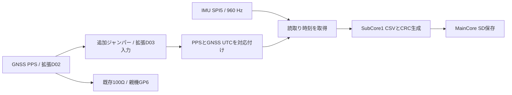
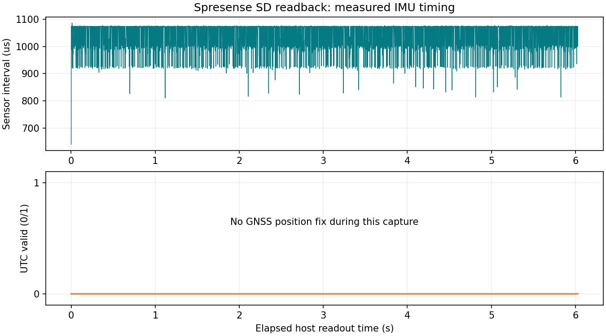

# Spresense IMU保存行へのUTC追加

| 項目 | 内容 |
|---|---|
| 実施日 | 2026-09-21 JST |
| 目的 | IMU行へUTCと品質情報を追加し、SD回収で確認する |
| 対象 | 公開main 1d92caeのSpresenseを基にした本レポート同梱変更 |
| 判定 | 一部合格。両コア書込み・SD読み戻し・UTC無効表示は合格。GPS未測位のため有効UTC/PPS精度は未検証 |

## 前提条件

接続対象はSony Spresense（CP210x COM7で識別）、拡張ボード、CXD5602PWBIMU系Multi-IMU、拡張SDHCIのSD。USB給電。SDの型番・容量、基板シルク版数は未確認。親機・子機のUSBは今回検出されず、書込み対象外。RX・水温・水圧・LCDは対象外。外部基準時計、オシロスコープは使用していない。

| 信号 | 接続・設定 | 今回の状態 |
|---|---|---|
| IMU | Sony公式SPI5ドライバー、960 Hz、4g/500 dps | 旧版稼働を確認 |
| SD | 拡張ボードSDHCI | 初回は初期化エラー。更新後の再起動で復旧、書込みと読み戻し成功 |
| UART | 拡張D01→100Ω→親機GP7（物理10）、共通GND | 既存構成、今回受信側未検証 |
| PPS | 拡張D02→100Ω→親機GP6（物理9） | 既存構成、今回受信側未検証 |
| PPS自己入力（追加） | 拡張D02→同じ拡張ボードD03、JP1=3.3V | ユーザーが接続完了を報告。継続PPS入力は未確認 |

Arduino Sony公式コア3.4.7、PlatformIO、Python、ホストC++テストを使用。circuit-designスキルのCircuitで追加配線の接続表を構造チェックした（PASS、信号配線のみのモデルなので電源ネット未指定警告）。電圧・実配線の実測保証ではない。

## 何をしたか・結果

1. 更新前のCOM7でIMU取得中、sd=0 / sd_errors=1を確認。qで記録キューへの投入を停止。SDは既に初期化失敗のため、停止完了表示は出ていない。
2. IMU CSVへUTC、UTC有効性、PPS対応条件、時刻源、GNSS通知経過時間、GNSS行番号を追加。GPS CSVにPPS時刻と番号を追加。
3. MainCoreとSubCoreの共有形式を更新。旧版混在時は誤解釈して記録せずエラー停止する。
4. 未測位・通知途絶・不正なPPS対応でUTCを無効にするロジックをホストで検証。

| 項目 | 結果 | 種別 |
|---|---|---|
| UTC換算・3回連続PPS対応・期限切れ・無効GPS・重複/不規則PPS | 合格 | 模擬入力 |
| CSV CRC・32行バッチ・カウンタラップ・境界・数値桁あふれ | 合格 | ホストC++ |
| 既存通信プロトコルテスト | 合格 | ホストC++ |
| Pythonログ検証テスト | 5件合格 | 模擬ログ |
| Spresense MainCore / SubCore1 | 両方ビルド成功 | ビルド |
| Pico Wi-Fi有 / 無の既存2構成 | 両方ビルド成功、実機へ書込みなし | 回帰ビルド |
| 両コア書込み | パッケージ検証・保存成功。Main転送リトライ1回で正常完了 | 実機 |
| SD読み戻し | IMU 5,825行、GPS 125行、CRCエラー0、IMU連番欠落0 | 実機 |
| 記録系エラー | IMU/キュー/SD/formatterエラー0、安全停止成功 | 実機 |
| IMUのUTC無効表示 | 全5,825行がUTC=0・utc_valid=0・source=0、期待どおり | 実機 |
| 実GPS/PPS UTC | GPS時刻有効0/125行。可視衛星最大2。PPSカウントは1のまま | 未検証 |

[ソフトウェア検証](evidence/software_checks.json)、[実機集計](evidence/hardware_checks.json)。受信位置を含む生ログは非公開のreports/rawに保存する。

## 保存時刻の意味と未検証事項

詳細は[保存形式](../../docs/SPRESENSE_LOG_FORMAT.md)。UTC列は**IMU読取り時点**の換算値。IMU内部の測定瞬間までの遅延は未校正。PPS対応成立は絶対UTC精度の合格を意味しない。GPS未測位時はUTC=0で保存する。GNSS通知による推定値はsource=1、連続PPS対応候補はsource=2。

時間基準を両CSVとPPSでArduinoの同じ64bit電源投入後カウンタに揃えた。コア設定の32768 Hzから算出した分解能は30.517578125 µsであり、1 µs精度ではない。両コア書込み→SD復旧→短時間記録→安全停止→I/Gファイル回収を完了。測位できず、有効UTC行が0のためGNSS UTCとの対応付け照合は0件。`utc_mismatch_rows=0`を有効UTCの実機合格と解釈してはいけない。PPSカウント1は継続パルスの証拠ではなく、立ち上がり等の単発エッジの可能性がある。GPSが受信できる場所で、連続PPS・source=2・有効UTC行を確認する必要がある。電源断後の自動保存は本実験では独立検証していない。

## 実測図

SDの実測値を使用。IMU記録期間は6.029053秒、読取り時刻基準の平均は約965.99行/秒（設定は960 Hz）。raw timestamp差分をSony参照の19.2 MHzで換算すると最小639.64、中央値1072.11、最大1086.51 µs。これは保存カウンタの間隔であり、センサー内部の物理的サンプリング周期の精度保証ではない。UTC精度の実測も未成立。検証終了時はSDを安全停止済み。次の再起動で自動記録を開始する。
