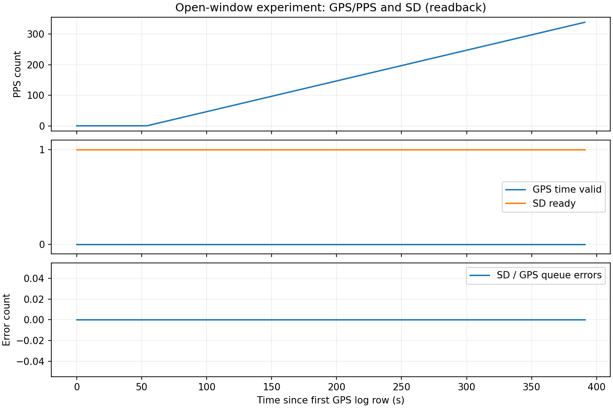

# 窓開放時のGPS・PPS・SD同時検証

| 項目 | 内容 |
|---|---|
| 実施日 | 2026-09-21 JST |
| 目的 | GPS/PPS有効化とSD異常の関連を観測する |
| ファーム | b7cd3c6（前回書込み済み、今回は変更・再書込みなし） |
| 判定 | 一部確認。PPS入力中のSD異常は再現せず。GPS測位成立時の検証は未完了 |

## 前提条件

ユーザーが窓を開放。Spresense CP210x COM7のUSB識別を再確認。Sonyメイン＋拡張ボード＋Multi-IMU（SPI5、設定960 Hz）＋拡張SDHCIのSD。SDの型番・容量と電源品質は未測定。親機・子機PicoのUSBは検出されず、両PicoのSDは直接検証していない。RX・水温・水圧・LCDは対象外。

| 信号 | 接続 | 根拠・状態 |
|---|---|---|
| PPS自己入力 | 拡張D02→拡張D03、JP1=3.3V | 前回ユーザーが配線完了申告、今回カウントを監視 |
| 親機PPS | 拡張D02→既存100Ω→GP6（物理9） | 既存配線、親機受信は今回未検証 |
| UART | 拡張D01→既存100Ω→GP7（物理10）、共通GND | 既存配線、親機受信は今回未検証 |
| IMU | Sony SPI5 Multi-IMU | 4g/500 dps、MainCore取得、SubCore1整形 |
| SD | Sony拡張SDHCI | 書込み状態・エラー・GPS CSV読み戻しを確認 |

## 手順

識別済みCOM7をリセットせずに開き、現在の起動セッションを継続。GPS fix/flags、PPSカウント、UTC source、IMU/SD/formatterエラーを記録。最長300秒、GPS時刻が有効になればその後25秒を観測する。終了時はqで安全停止しGPS CSVを回収、CRCとPPS周期を集計する。IMU全ファイルのUSB回収は今回の対象外。生ログは非公開reports/rawに保管し、位置情報を含まない集計と図を公開する。

## SD表示を解釈する際の注意

現在のSpresense実装は安全停止q後にもsdReady=false、UARTのsd_ok=0になる。Web画面はこの値を「異常／未準備」と表示するため、正常な記録停止も同じ表示になる。これはソースで確認できる表示上の曖昧さであり、今回ユーザーが見た現象の原因だと断定はしない。SDエラーカウンタ増加・記録中のsd=0・停止完了表示を分けて判断する。

## 結果

| 確認項目 | 結果 |
|---|---|
| 新規シリアル観測 | 300秒＋安全停止後。302件の状態報告 |
| SD異常 | 記録中のsd=0は0件。SD/IMU/キュー欠落エラーすべて0 |
| SD記録カウンタ | 停止時264,311行（ヘッダー2行を含む） |
| GPS SD読み戻し | 392行、CRCエラー0。現在の起動セッションの観測開始前の行も含む |
| IMU SD行数 | カウンタから263,917行と推計。IMUファイル全体の読み戻し・CRC確認は未実施 |
| PPS自己入力 | カウント1→338。初期エッジ後に約58.319秒の空白あり、その後は継続 |
| 継続PPS周期 | 336区間：最小999,938、中央値999,969、最大1,000,000 µs |
| GPS | 可視衛星最大4、測位成立0、UTC有効0/392行、utc_source=0 |
| 検証終了 | qによる安全停止成功。停止後はsd=0、sd_errors=0 |

PPS周期はSpresenseの32768 Hzカウンタ基準。GPS時刻の有効性・絶対UTC精度を保証しない。[集計](evidence/results.json)を参照。

図は回収したGPS CSVの実測値。GPS測位が成立していないため、「GPSとPPSが両方有効になるとき」のSD異常を否定する結果ではない。現段階ではPPS入力だけでSD異常になる現象は再現しなかった。

## 過去ログとの照合（今回の実測とは区別）

実験016の既存ログでは、t=58.710秒にGPS fix=3 / flags=15 / SDエラー0、t=58.774秒にSTOPPED_REMOVE_SD、t=59.698秒にsd=0 / sd_errors=0となった。GPS有効20回の確認後に検証スクリプトが意図的にqを送っていた。[該当抜粋](evidence/prior_stop_excerpt.json)。この動作でもWebの「異常／未準備」表示になる。ユーザー報告との同一性は未確認。

## 残る確認

GPS時刻有効の遷移前後、親機Pico自身のSD、Spresenseと親機の実際の電源電圧、IMU全ファイルの保存完全性は未検証。ユーザーから「親機が読み取るSpresenseのSD異常表示」と確認済み。この表示は保存中フラグsd_okに依存し、安全停止でも異常／未準備表示になる。今回の停止後の状態および過去実験016の遷移と整合するが、ユーザーが見た各発生時刻との直接照合は未実施。今回はファームウェア・Web表示の修正や書込みを行っていない。検証後はSDを安全停止しているため、表示上は保存停止になる。次の再起動で自動記録を開始する。
