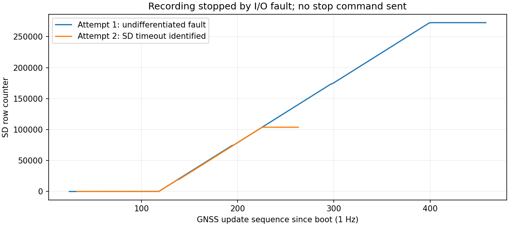

# GPS受信後のSD連続記録

| 項目 | 内容 |
|---|---|
| 実施日 | 2026-09-21 JST |
| 目的 | GPS受信後も、検証終了後もSD記録を継続する |
| 対象 | 4a1c408を基にした本レポート同梱のSpresense MainCore更新 |
| 判定 | GPS確認後の自動停止を撤廃済み。ただし別のSD書込みタイムアウトを再現。カード確認待ち |

## 前提条件・ピン配置

Sonyメイン＋拡張ボード＋Multi-IMU＋SDHCI SD、COM7 USB接続（個体識別済み）。窓を開けた状態。IMU SPI5・960 Hz設定・4g/500 dps、PPSは拡張D02→D03（JP1=3.3V）。既存の親機接続はD02→100Ω→GP6（物理9）、D01 UART→100Ω→GP7（物理10）、共通GND。親機・子機USBは未検出で今回書込みなし。RX・水温・水圧・LCDは対象外。SD型番、電源電圧は未測定。ファイルシステム容量は15,625,879,552 bytes、異常時空き15,411,281,920 bytes。Sony公式Arduino 3.4.7を使用。

## 原因と変更

ファームウェアにGPS測位成功による自動停止条件はなかった。旧PC検証スクリプトがGPS受信確認後、または観測時間終了時にqを送っていたことが停止原因。親機の旧表示では正常停止も異常／未準備になる。

- 通常監視用 `scripts/monitor_spresense.py` を追加。シリアルを読み取るだけで、成功・時間切れ・中断のいずれでも停止命令やリセットを送らない。
- AGENTS.mdに、GPS受信・PPS成立・検証終了を理由に記録を停止しない運用を明記。旧reports/rawの停止付きスクリプトは再利用しない。
- Sonyにrによる記録再開を追加。完了した正常停止からGNSSを維持したまま新規I/Gファイルに再開できる。記録中は何もしない。停止処理中・SD異常・formatter異常は再開を拒否する。
- シリアルにrecordingとsd_stateを追加し、記録中・正常停止・異常を区別する。親機側のUI/APIは今回は変更していない。

## 検証

| 項目 | 結果 |
|---|---|
| Sony MainCore / SubCore1ビルド | 成功。変更したMainCoreを実機へ書込み、パッケージ検証成功 |
| 既存共通C++テスト2本 | 合格 |
| Pythonテスト | 8件合格（監視が成功・時間切れ・中断でも書込みを送らない3件を含む） |
| Pico Wi-Fi有/無ビルド | 成功、実機書込みなし |
| 更新前 | 前回の正常停止（sd=0、sd_errors=0）を確認。今回q送信なし |
| 初回連続試験 | GPS未測位中、保存272,571行付近で従来のFORMATTER_FAILED表示が発生。ソフトからqは送っていない |
| 診断追加後 | 保存103,808行付近でSD_WRITE_FAILED errno=110 / result=-1 / written=0 / requested=2422を再現 |
| 特定した発生箇所 | IMUのSD write。整形エラーとまとめられていた従来表示を原因別に分離 |
| 空き容量 | 約15.4 GBあり、容量不足ではない |
| GPS/PPS | 両試験の異常発生時ともGPS未測位・UTC同期未成立。GPS成功による停止ではない |
| 次の実機操作 | 異常後のファイルはクローズ済み。ユーザーへ給電停止・SD挿し直しまたは別カードへの交換を依頼、回答待ち |

## 制限

更新による再起動を2回実施。今回は記録を継続するため、qによる停止・ログ全体のエクスポートは行わない。停止→r再開の実機試験は未実施（通常運転を中断しない）。PPS対応条件成立は絶対UTC精度の実測保証ではない。旧ファイルは保持する。

## 実エラーの診断と追加修正

[初回の停止](evidence/initial_failure.txt)、[詳細診断付きの再現](evidence/sd_timeout.txt)、[集計](evidence/results.json)。errno=110はタイムアウト。物理カード、接点、電源品質、SDHCI/ドライバーのどれが根本原因かは未確定。従来のformatter_errorsはSD書込み失敗でも加算されるため、SubCore自体が故障したと解釈してはいけない。

writeの一部完了・EINTR時は未完了分を続けるよう修正したが、その後にもETIMEDOUTが再現した。タイムアウトを無視して正常記録と表示する変更はしていない。診断用vで空き容量を表示できる。既存ファイルを削除・フォーマットしていない。GPSで止めない変更と、今回新たに再現した実際のSD故障は別問題として扱う。

図はシリアル状態の実測。横軸は起動後のGNSS更新番号（1 Hz）、縦軸はヘッダーを含む累計保存行数。横ばいになった部分は実エラーによる停止であり、成功した連続記録としては扱わない。
