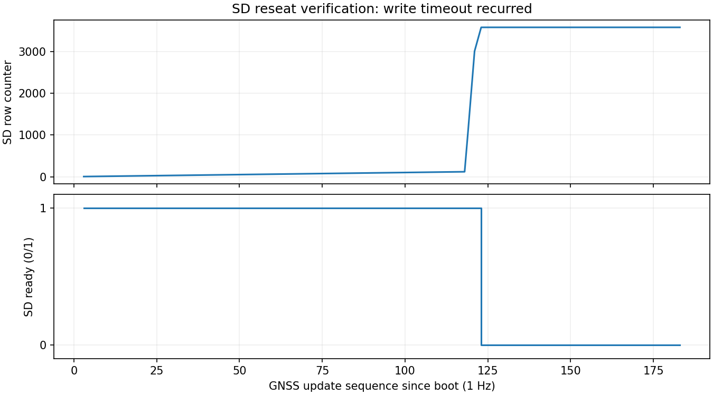

# SD挿し直し後の再検証

| 項目 | 内容 |
|---|---|
| 実施日 | 2026-09-21 JST |
| 目的 | ユーザーのSD挿し直し後、Spresenseの連続保存が復旧するか確認 |
| 対象 | 最初はabb9564、その後は本レポート同梱の保存確定診断追加版 |
| 判定 | 挿し直し後もSD書込みタイムアウトを再現。連続記録は復旧せず |

## 前提条件・接続

ユーザーがSDを挿し直したと申告。同じカードか交換したかは未確認。Sonyメイン＋拡張ボード、SPI5 Multi-IMU（960 Hz設定、4g/500 dps）、拡張SDHCIのSD、USB給電・COM7で個体識別。拡張D02→D03はPPS自己入力（JP1=3.3V）。既存親機配線はD02→100Ω→GP6（物理9）、D01 UART→100Ω→GP7（物理10）、共通GND。親機・子機のUSBは検出されず、書込み対象外。RX・水温・水圧・LCDは対象外。電源電圧・SD型番は未測定。ファイルシステム容量15,625,879,552 bytes、開始時空き15,411,150,848 bytes。

## 手順・変更

1. リセットせず状態を確認。最初からsd=0 / sd_rows=15 / sd_errors=1 / imu=0だった。IMU開始やGPS測位成功の前に保存が止まっており、挿し直しだけで復旧したとは判断できなかった。[開始時状態](evidence/before.txt)。
2. 保存確定fsyncでEINTRだけを再試行するよう修正。失敗時はファイル種別・errnoを出すようにし、取得を保存キューへ投入し続けず停止・ファイルクローズへ進むよう修正した。書込みタイムアウトを正常扱いする変更ではない。
3. 更新前の安全なファイルクローズのためだけにqを送信。識別済みSonyへMainCoreを書込み、パッケージ検証成功。更新で一度再起動した。
4. 以後は読取り専用monitor_spresense.pyで観測。GPS受信・監視終了を理由にqを送らない。

## 結果

Sony Main/SubCoreビルド、既存C++テスト2本、Pythonテスト8件は合格。共通コードとPicoコードは変更していない。

| 実機確認 | 結果 |
|---|---|
| 再起動直後 | SD記録正常、エラー0で開始 |
| IMU開始後 | 保存3,579行付近でIMU_SD_WRITEの失敗を再現 |
| writeの詳細 | errno=110（ETIMEDOUT）、result=-1、完了0 bytes / 要求2,342 bytes |
| 空き容量 | 15,410,659,328 bytes。容量不足ではない |
| GPS/UTC | 測位未成立、UTC同期未成立。GPS成功に伴う自動停止ではない |
| 終了時 | sd=0、recording=0、sd_state=ERROR。エラー後にファイルをクローズ |
| 次の切り分け | 別SDカードへの交換を依頼。カードと、基板・給電・ドライバー側を区別する必要がある |

[エラー前後](evidence/timeout.txt)、[集計](evidence/results.json)。今回も監視終了時のq送信はしていない。今回のエラーはfsyncではなくIMUのwriteで特定できた。根本原因は未確定で、ソフトだけで解決したとは報告しない。

図はシリアル状態の実測。ヘッダーを含む保存行数カウンタが停止し、SD正常フラグが落ちることを示す。SDファイル全体の読み戻しは未実施。

## 限界

今回の実機異常は開始時の状態だけではwriteとfsyncのどちらか特定できない。前回024ではwriteのETIMEDOUTを確認済み。今回EINTR対策を追加したことだけで前回タイムアウトの根本原因が解決したとはしない。停止→r再開試験、SD全ログの読み戻し、電源品質、GPS絶対精度の検証は対象外。ログ取得のための追加停止はしない。
