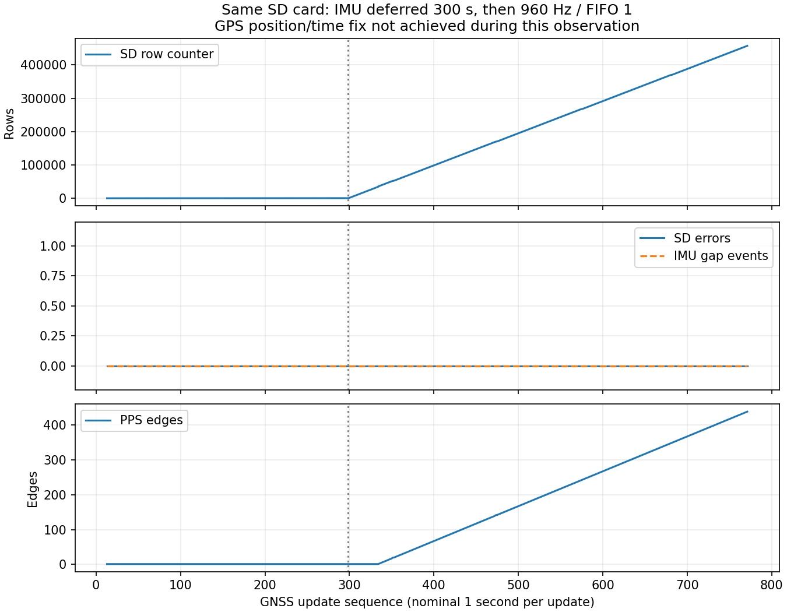

# 同じSDカードでの保存負荷切り分け

| 項目 | 内容 |
|---|---|
| 実施日 | 2026-09-21 JST |
| 目的 | 交換カードなしで、IMU動作・保存負荷とSDタイムアウトの関係を調べる |
| 対象 | a2b547cを基にした一時診断版。変更差分はevidence内 |
| 判定 | 同一カードで連続保存を確認。ただしGPS測位成立時の停止は未解決 |

## 前提条件・接続

同じSDカード（容量15,625,879,552 bytes、型番未確認）を継続使用。既存ファイルの削除・フォーマットなし。Sonyメイン＋拡張ボード、SPI5 CXD5602PWBIMU、拡張SDHCI、USB給電。COM7のCP210x VID/PIDと既知の個体番号を照合。Sony Arduino core 3.4.7。親機・子機のUSBは見つからず書込み対象外。RX、水温、水圧、LCDは対象外。給電電圧、カードの物理健全性、親機・子機の実接続は今回未測定。

| 信号 | 配線・設定 | 確認 |
|---|---|---|
| PPS自己入力 | 拡張D02→D03、JP1=3.3V | 既報ユーザー確認済み、今回変更なし |
| 親機PPS | D02→既存100Ω→GP6（物理9） | 既存構成、今回電気測定なし |
| 親機UART | D01 TX→既存100Ω→GP7（物理10）、共通GND、115200 bps | 既存構成 |
| IMU | SPI5、960 Hz、4g/500 dps | ソフト設定 |
| SD | 拡張SDHCI | 同じカードで比較 |

## 何をしたか

開始時は前回のSD異常でファイルクローズ済み。診断版をMainCoreだけに書込み、SubCore1は変更しない。

1. IMU開始だけを固定300秒後に変更し、最初の区間はGNSSとSD保存を継続する。300秒後は従来の960 Hz・FIFO閾値1で取得・保存する。同じ起動中で比較するが、IMU消費電力・割り込み負荷・保存量が同時に変わるため、この試験単独で原因部位は特定できない。
2. 監視は読取り専用。観測終了やGPS受信を理由にqを送らない。後続ファーム更新が必要な場合だけ事前にファイルを安全に閉じる。
3. FIFO閾値4の候補をビルドしたが、今回は書込み・実機評価しなかった。比較区間でSDが正常に継続しており、測位を待つ間の再起動を避けた。サンプリング960 Hzは維持し、名目割り込み頻度は240回/秒になる。SDK 3.4.7の実際のドライバーは閾値1〜4、16サンプルの上書きバッファを使用する。読取り時刻は物理測定時刻ではなく、FIFOの分だけ遅れる。

根拠：[使用SDKと一致するSony NuttXドライバー](https://github.com/SPRESENSE/nuttx/blob/a98b7ce090a0db5aa36c0feced496592735c5c57/drivers/sensors/cxd5602pwbimu.c)。試験版の差分は[baseline.patch](evidence/baseline.patch)、[fifo4.patch](evidence/fifo4.patch)。生ログは位置情報混入を避けるためreports/rawにのみ保存する。

## 結果

ユーザーから「GPS受信成功時に停止することは間違いない」と再申告があった。この観察を否定せず、今回の未測位状態での結果と区別する。

| 確認項目 | 今回の実測・結果 |
|---|---|
| IMU待機 | 300,063 ms後に自動開始。開始前の最終SDカウンタ300行、SDエラー0 |
| IMU開始後 | 960 Hz設定、最終取得456,758件、SDカウンタ457,488行 |
| エラー・欠落 | SDエラー0、IMUエラー0、IMUギャップ0、キュー欠落0 |
| GPS | 最終GNSS更新番号771。測位・有効UTC未成立 |
| PPS | 最終438エッジ、UTC同期未成立 |
| 記録 | 観測終了時もrecording=1 / sd=1、終了時の停止指示なし |
| ソフト検証 | 診断版2種ビルド成功、Python8件・既存C++2スイート合格。FIFO4版は未書込み |

本文の行数は書込み成功時のカウンタであり、全件のSD読み戻し保証ではない。ログ形式・UTC付与の既存CRC/容量検査も合格したが、GPS実受信時の異常を再現できていないため修正完了とはしない。

[集計とファームウェアSHA256](evidence/results.json)、[終了時状態](evidence/final_status.txt)。最初の監視440秒、追加監視300秒。間の接続切替中も機体の記録は継続し、グラフは取得できた状態通知に基づく。

点線はIMU開始直前のGNSS更新番号。x軸は約1秒周期のGNSS更新番号であり、精密な経過時間計測ではない。今回1回の成功で、過去のタイムアウトやGPS測位成立時の不具合が解消したとは判断できない。

## 終了時の実機設定

受信待ちをやり直さないよう、固定300秒待機の診断版を動作させたままにした。待機区間は終了し、現在は通常と同じ960 Hz・FIFO閾値1で取得・記録する。次の電源投入でも最初の300秒はIMUを待機する点が通常版と異なる。製品ソースの起動条件は変更していない。正常運転中のファイル回収・停止は行わない。

## 限界

ソフトのビルド成功とSDの実機連続記録成功を区別する。カード、接点、給電、SDドライバーのどれが原因かは、この比較だけでは断定できない。GPS/PPS成立時のUTC絶対精度、SD全ファイルの読み戻しは別検証。
